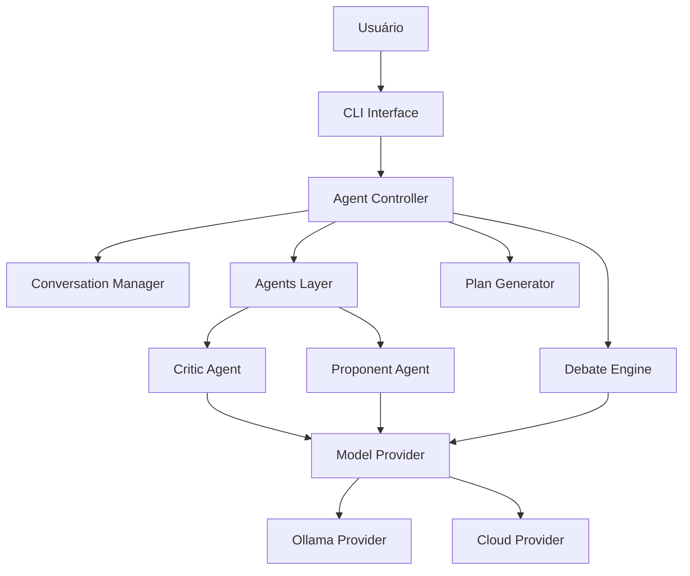
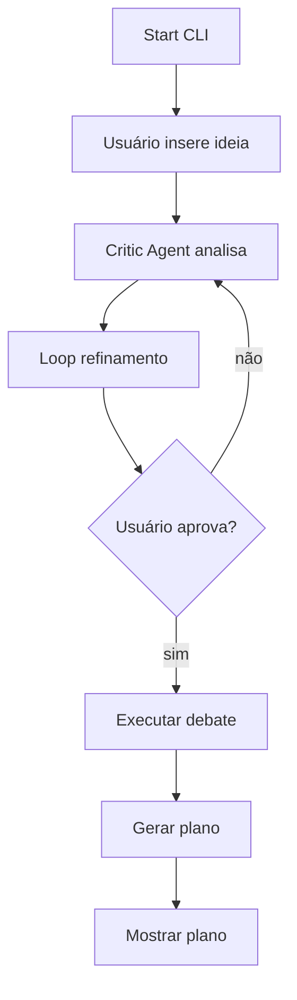

# Blueprint Técnico — IdeaForge CLI

Arquitetura Técnica Definitiva do MVP

Versão: 0.1

---

# 1. Propósito do Blueprint

Este documento define **a estrutura técnica exata do sistema** antes da implementação.

Funções do blueprint:

* eliminar ambiguidade arquitetural
* definir responsabilidades dos módulos
* padronizar interfaces
* garantir construção determinística do sistema

Este documento responde **como o sistema é estruturado internamente**.

---

# 2. Arquitetura Geral do Sistema

O sistema segue arquitetura **orquestrada em camadas**.



---

# 3. Camadas do Sistema

## 3.1 Interface Layer

Responsabilidade:

Interação com usuário via terminal.

Componentes:

```
src/cli/
main.py
```

Funções:

* receber input do usuário
* exibir respostas
* controlar comandos

Regra estrutural:

CLI **não contém lógica de negócio**.

---

## 3.2 Controller Layer

Responsabilidade:

Orquestrar o fluxo completo do sistema.

Componente:

```
src/core/controller.py
```

Funções:

* iniciar pipeline
* controlar etapas
* coordenar agentes
* controlar aprovação do usuário

Fluxo interno:

```
receber ideia
↓
enviar para critic_agent
↓
executar loop de refinamento
↓
aprovação do usuário
↓
executar debate
↓
gerar plano
```

---

## 3.3 Conversation Layer

Responsabilidade:

Gerenciar contexto das interações.

Componente:

```
src/conversation/conversation_manager.py
```

Funções:

* armazenar histórico
* recuperar contexto
* preparar prompt acumulado

Estrutura de dados:

```
conversation_history = [
    {role: "user", content: "..."},
    {role: "assistant", content: "..."}
]
```

---

## 3.4 Agents Layer

Responsabilidade:

Executar raciocínio especializado.

Diretório:

```
src/agents/
```

Agentes iniciais:

```
critic_agent.py
proponent_agent.py
```

---

### Critic Agent

Função:

Analisar ideias e encontrar problemas.

Responsabilidades:

* identificar lacunas
* questionar premissas
* sugerir melhorias

Interface:

```
analyze(idea, history) -> critique
```

---

### Proponent Agent

Função:

Defender e estruturar proposta.

Responsabilidades:

* organizar solução
* propor arquitetura
* responder críticas

Interface:

```
propose(idea, debate_context) -> defense
```

---

# 4. Debate Engine

Responsabilidade:

Executar debate estruturado entre agentes.

Localização:

```
src/debate/debate_engine.py
```

Estrutura do debate:

```
round 1
proponent responde

round 2
critic responde

round 3
proponent responde
```

Número padrão de rounds

3

Saída:

```
debate_result = {
    strengths,
    weaknesses,
    risks,
    recommendations
}
```

---

# 5. Plan Generator

Responsabilidade:

Transformar debate em plano técnico.

Localização:

```
src/planning/plan_generator.py
```

Entrada:

```
debate_result
idea
```

Saída:

```
development_plan
```

Conteúdo gerado:

* arquitetura sugerida
* módulos
* fases de implementação
* responsabilidades técnicas

---

# 6. Model Provider Layer

Responsabilidade:

Abstrair acesso a LLMs.

Localização:

```
src/models/model_provider.py
```

Interface base:

```
class ModelProvider:

    def generate(prompt, context, role):
        pass
```

Implementações:

```
OllamaProvider
CloudProvider
```

---

# 7. Ollama Provider

Localização:

```
src/models/ollama_provider.py
```

Função:

Enviar prompts para modelos locais.

Endpoint padrão:

```
http://localhost:11434/api/generate
```

Configuração:

```
MODEL_NAME=llama3
```

---

# 8. Cloud Provider

Localização:

```
src/models/cloud_provider.py
```

Função:

Conectar com APIs externas.

Exemplo:

OpenAI
Anthropic
Google

Interface igual ao provider local.

---

# 9. Fluxo de Execução do Sistema

Fluxo completo:



---

# 10. Contratos Entre Módulos

CriticAgent

Entrada

```
idea: string
history: conversation[]
```

Saída

```
critique: string
```

---

ProponentAgent

Entrada

```
refined_idea
debate_context
```

Saída

```
defense: string
```

---

DebateEngine

Entrada

```
idea
critic_agent
proponent_agent
```

Saída

```
debate_result
```

---

PlanGenerator

Entrada

```
debate_result
```

Saída

```
development_plan
```

---

# 11. Estrutura de Pastas Final

```
idea-forge/

src/

cli/
main.py

core/
controller.py

agents/
critic_agent.py
proponent_agent.py

debate/
debate_engine.py

planning/
plan_generator.py

models/
model_provider.py
ollama_provider.py
cloud_provider.py

conversation/
conversation_manager.py

config/
settings.py
```

---

# 12. Regras Arquiteturais

Regra 1
CLI nunca contém lógica de negócio.

Regra 2
Controller controla o fluxo.

Regra 3
Agentes não acessam CLI.

Regra 4
Agentes não acessam filesystem.

Regra 5
Apenas ModelProvider comunica com LLM.

Regra 6
DebateEngine não gera prompts diretamente.

Ele usa agentes.

---

# 13. Extensibilidade Arquitetural

Novos agentes podem ser adicionados.

Exemplo:

```
agents/

architect_agent.py
security_agent.py
performance_agent.py
```

Debate Engine pode aceitar múltiplos agentes.

---

# 14. Limites do MVP

Sem persistência.

Sem banco de dados.

Sem UI.

Sem paralelismo.

Sistema sequencial.

---

Fim do Blueprint Técnico.