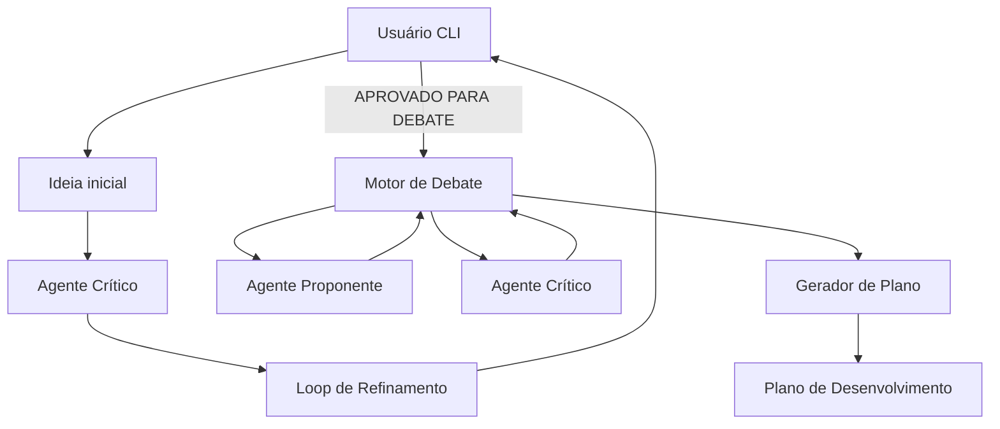
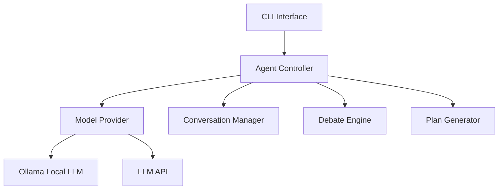

# PRD — MVP Sistema de Debate de Ideias Assistido por IA

Versão: 0.1 — MVP

---

# 1. Visão Geral do Produto

Nome do projeto
IdeaForge CLI

Missão
Permitir que desenvolvedores transformem ideias vagas em **planos de desenvolvimento estruturados** através de **refinamento iterativo e debate entre agentes de IA** antes da implementação de código.

Problema que resolve
Projetos de software frequentemente começam com ideias incompletas ou ambíguas. Isso gera:

* arquitetura frágil
* retrabalho
* alucinação de LLMs
* desperdício de tempo de desenvolvimento

O sistema cria um **processo estruturado de análise antes da codificação**.

Público-alvo (personas)

Persona 1
Lucas — Engenheiro Backend

Dor
Começa projetos com ideias vagas e precisa estruturar arquitetura antes de codificar.

Persona 2
Carla — Indie Hacker

Dor
Precisa validar ideias de produto rapidamente sem gastar semanas planejando.

Persona 3
André — Tech Lead

Dor
Precisa transformar ideias de time em documentação estruturada para execução.

Proposta de valor

Transformar:

Ideia vaga
→ questionamento crítico
→ debate estruturado
→ plano técnico executável

Diferenciais

Comparado com uso direto de LLM:

| Abordagem         | Problema                |
| ----------------- | ----------------------- |
| Prompt único      | respostas superficiais  |
| Chat linear       | pouca estrutura         |
| LLM coding direto | alucinação arquitetural |

O sistema cria um **pipeline cognitivo estruturado**.

---

# 2. Arquitetura de Alto Nível

Fluxo principal



Arquitetura do sistema



Tecnologias

Linguagem
Python

Motivo
simplicidade + integração forte com LLM

Interface
CLI

Motivo
evitar complexidade de frontend

LLM Provider

Suporte a:

Ollama (local)
APIs cloud

Motivo

* flexibilidade
* privacidade
* custo

Modelo de deploy

Local CLI application

Nenhuma infraestrutura necessária.

Padrões de design

Command Pattern
usado no CLI

Strategy Pattern
para seleção de LLM provider

Controller Pattern
coordenação dos agentes

---

# 3. Estrutura de Diretórios

Estrutura do projeto

```
idea-forge/

src/
│
├── cli/
│   └── main.py
│
├── agents/
│   ├── critic_agent.py
│   ├── proponent_agent.py
│
├── debate/
│   └── debate_engine.py
│
├── planning/
│   └── plan_generator.py
│
├── models/
│   └── model_provider.py
│
├── conversation/
│   └── conversation_manager.py
│
├── core/
│   └── controller.py
│
├── config/
│   └── settings.py
│
tests/

README.md
requirements.txt
.env.example
```

Explicação das pastas

cli/
Entrada do sistema.

agents/
Implementação dos agentes de IA.

debate/
Motor de debate multi-agente.

planning/
Geração de plano final.

models/
Integração com LLM providers.

conversation/
Gestão do histórico.

core/
Coordenação do sistema.

---

# 4. Requisitos Funcionais

RF-001
Entrada de ideia

Usuário digita uma ideia no terminal.

Sistema registra a ideia.

Resultado
ideia enviada ao agente crítico.

---

RF-002
Refinamento iterativo

O agente crítico:

* identifica lacunas
* faz perguntas
* propõe melhorias

Loop continua até:

APROVADO PARA DEBATE

---

RF-003
Execução de debate

Sistema instancia dois agentes:

Proponente
Crítico

Eles debatem a proposta.

Rodadas de debate:

3 a 5 ciclos.

---

RF-004
Geração de documento de análise

Saída do debate:

* pontos fortes
* pontos fracos
* riscos
* sugestões

---

RF-005
Aprovação humana

Usuário decide:

APROVAR
ou
REFINAR NOVAMENTE

---

RF-006
Geração do plano de desenvolvimento

Plano inclui:

* arquitetura
* módulos
* fases
* responsabilidades

---

# 5. Requisitos Não Funcionais

Performance

Tempo máximo por etapa

| etapa       | tempo |
| ----------- | ----- |
| refinamento | <20s  |
| debate      | <40s  |
| plano       | <15s  |

---

Segurança

Sem autenticação.

Uso local.

---

Escalabilidade

Não aplicável no MVP.

---

Compatibilidade

Python 3.10+

OS

Linux
Mac
Windows

---

# 6. Justificativa de Stack

Python

Motivo

* integração com LLM
* prototipagem rápida

Alternativas

Node
Go

Motivo da escolha

simplicidade.

---

Ollama

Motivo

execução local de LLM.

Benefícios

* privacidade
* custo zero
* latência baixa

---

LLM APIs

Motivo

modelos maiores disponíveis.

---

# 7. Componentes Críticos

CLI Interface

Responsável por:

* receber ideia
* mostrar respostas
* controlar fluxo

---

Agent Controller

Coordena:

* refinamento
* debate
* geração de plano

---

Model Provider

Interface comum:

```
generate(prompt)
```

Implementações:

OllamaProvider
CloudProvider

---

Conversation Manager

Mantém:

* histórico
* contexto

Evita perda de informação.

---

Debate Engine

Executa rounds.

Fluxo

```
proponente responde
critico responde
loop
```

---

Plan Generator

Transforma debate em:

plano estruturado.

---

# 8. Pipeline Cognitivo

Pipeline

```
IDEIA
 ↓
CRÍTICA
 ↓
REFINAMENTO
 ↓
DEBATE
 ↓
PLANO
```

Cada etapa reduz ambiguidade.

---

# 9. Integrações Externas

Ollama

Configuração

```
ollama serve
```

---

Cloud LLM

Env

```
LLM_API_KEY=
LLM_PROVIDER=
```

---

# 10. Segurança

Sistema local.

Sem autenticação.

Sem armazenamento sensível.

---

# 11. Infraestrutura

Não possui.

Rodando localmente.

---

# 12. Extensibilidade

Novos agentes podem ser adicionados.

Exemplo

```
agents/
architect_agent.py
security_agent.py
```

---

# 13. Limitações

LLM pode alucinar.

Debate depende de qualidade do modelo.

Sem persistência.

---

# 14. Roadmap

Versão 0.2

* persistência
* export markdown
* mais agentes

Versão 0.3

* interface web

Versão 1.0

* multi-projeto
* memória longa

---

# 15. Guia de Replicação

Pré-requisitos

Python 3.10+

Instalar

```
pip install -r requirements.txt
```

Executar

```
python src/cli/main.py
```

Configurar env

```
LLM_PROVIDER=ollama
MODEL_NAME=llama3
```

Rodar

```
python main.py
```

Sistema inicia no terminal.

Usuário insere ideia.

Pipeline executa.

Plano final é gerado.
