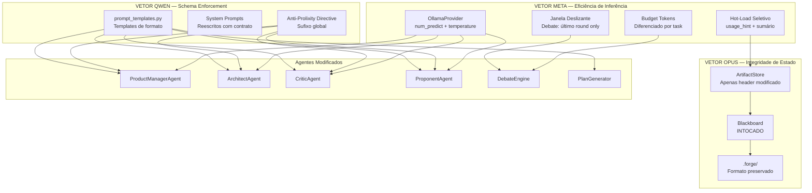

# BLUEPRINT — FASE 3.1: OPERAÇÃO LIMPEZA (MODO MINIMALISTA E SCHEMA ENFORCEMENT)

---

# PHASE_3.1_OVERVIEW.md

## 1. OBJETIVO DE NEGÓCIO MENSURÁVEL

Reduzir a prolixidade dos artefatos gerados pelo pipeline IdeaForge em **≥ 60%**, medido pela **razão token/dado-técnico**, sem perda de informação executável.

**Definição formal de "dado técnico":** Linha que inicia com `|` (tabela), `-` (bullet), `1.`-`9.` (lista numerada), `##` (heading), ou ``` (código/diagrama). Tudo o mais é classificado como "ruído narrativo".

**Métrica primária — Density Score:**
```
density_score = linhas_técnicas / total_linhas
```

| Artefato | Density Score Atual (medido) | Target Fase 3.1 |
|---|---|---|
| PRD | ~0.35 (65% narrativa) | ≥ 0.85 |
| System Design | ~0.40 (60% narrativa) | ≥ 0.85 |
| PRD Review | ~0.30 (70% narrativa) | ≥ 0.80 |
| Debate Transcript (por round) | ~0.25 (75% narrativa) | ≥ 0.70 |
| Development Plan | ~0.40 (60% narrativa) | ≥ 0.80 |

**Métrica secundária — Consumo de tokens:**

| Artefato | Tokens Atual (estimado do relatório) | Target Fase 3.1 |
|---|---|---|
| PRD | ~3000 | ≤ 800 |
| System Design | ~2500 | ≤ 700 |
| PRD Review | ~2000 | ≤ 500 |
| Debate (total 3 rounds) | ~8000 | ≤ 2400 |
| Development Plan | ~2500 | ≤ 800 |
| **Pipeline Total** | **~18000** | **≤ 5200 (~71% redução)** |

**Métrica terciária — Idioma:**
100% das saídas em Português. Zero respostas em inglês.

## 2. DIAGNÓSTICO FORMAL DA PROLIXIDADE

### 2.1 — Taxonomia de Ruído Identificada

Analisando o relatório `debate_RELATORIO_20260319_164741.md`, classifiquei o ruído em 5 categorias:

| Categoria | Exemplo Real do Relatório | Tokens Desperdiçados | Frequência |
|---|---|---|---|
| **Introdução Cerimonial** | "This document outlines the requirements for a new mobile platform designed to streamline..." | ~50 por ocorrência | 1x por artefato |
| **Meta-Comentário** | "Okay, let's dive deeper into this. This is a solid starting point, but..." | ~40 por ocorrência | 2x por round de debate |
| **Recapitulação do Input** | Architect repete Business Goals, Target Audience, Product Overview do PRD | ~400 por artefato | System Design inteiro |
| **Personas Fictícias** | "Buyer - Sarah: A 28-year-old marketing professional who uses her smartphone daily..." | ~150 por persona | 2-3 personas por PRD |
| **Conclusão/Próximos Passos** | "This PRD serves as a foundation... Regular reviews and updates will be conducted..." | ~60 por ocorrência | 1x por artefato |

**Desperdício total estimado: ~12.000 tokens de ~18.000 = 67% do pipeline é ruído.**

### 2.2 — Causa Raiz por Arquivo

| Arquivo | Causa Raiz | Vetor de Ataque |
|---|---|---|
| `product_manager_agent.py` | Prompt pede "PRD completo" sem template forçado | Qwen (Schema) |
| `architect_agent.py` | Prompt pede "System Design document" sem anti-repetição | Qwen (Schema) + Meta (Deduplicação) |
| `critic_agent.py` | `review_artifact()` não proíbe narrativa, não força formato de lista | Qwen (Schema) |
| `proponent_agent.py` | `defend_artifact()` permite meta-comentários e resumos | Qwen (Schema) |
| `artifact_store.py` | Hot-load injeta artefato completo sem hint de uso | Meta (Deduplicação) |
| `debate_engine.py` | Contexto acumula linearmente sem janela deslizante | Meta (Eficiência) |
| `ollama_provider.py` | Sem `num_predict` (max output tokens), sem `temperature` baixa | Meta (Restrição física) |
| `planner.py` | `max_context_tokens=1500` uniforme para todas as tasks | Meta (Budget diferenciado) |

## 3. ESCOPO FECHADO

### INCLUI

- Criação de `src/core/prompt_templates.py` — templates de formato obrigatório
- Modificação de `src/agents/product_manager_agent.py` — system prompt minimalista
- Modificação de `src/agents/architect_agent.py` — system prompt minimalista + anti-repetição
- Modificação de `src/agents/critic_agent.py` — `review_artifact()` com formato de lista
- Modificação de `src/agents/proponent_agent.py` — `defend_artifact()` com anti-prolixidade
- Modificação de `src/core/artifact_store.py` — context framing com `usage_hint`
- Modificação de `src/debate/debate_engine.py` — janela deslizante de contexto
- Modificação de `src/models/ollama_provider.py` — `num_predict` + `temperature` por modo
- Modificação de `src/core/planner.py` — budget diferenciado por task + post-processor
- Criação de `tests/test_prompt_quality.py` — testes de density_score e formato
- Modificação de `src/planning/plan_generator.py` — template forçado

### NÃO INCLUI

- Alteração de `src/models/model_provider.py` (interface base preservada)
- Alteração de `src/models/cloud_provider.py` (mantido como mock)
- Alteração de `src/core/stream_handler.py` (streaming intocado)
- Alteração de `src/core/blackboard.py` (estado intocado)
- Alteração de `src/config/settings.py` (configuração intocada — novos params vão no provider)
- Remoção de nenhum método existente (backward compatibility total)

## 4. INVARIANTES

1. **Contrato `generate(prompt, context, role) -> str` preservado**
2. **Contrato `generate_with_thinking()` preservado**
3. **Métodos existentes dos agentes preservados** (`analyze()`, `propose()`, `generate_prd()`, `design_system()`)
4. **Persistência do Blackboard preservada** (`.forge/` intocado)
5. **Testes existentes devem continuar passando**
6. **Zero dependências externas novas**

## 5. CRITÉRIOS OBJETIVOS DE CONCLUSÃO

- [ ] `python -m pytest tests/` — 100% passed
- [ ] PRD gerado contém density_score ≥ 0.85
- [ ] System Design gerado não repete seções do PRD (Business Goals, Target Audience, etc.)
- [ ] Nenhum artefato começa com frase introdutória ("This document...", "Okay, let's...")
- [ ] 100% dos artefatos em Português
- [ ] Consumo total de tokens do pipeline ≤ 6000 (medido pelo `token_estimate()` dos artefatos)
- [ ] `ollama_provider.py` envia `num_predict` e `temperature` no payload
- [ ] Debate usa janela deslizante (contexto por round ≤ 500 tokens)

---

# PHASE_3.1_ARCHITECTURE.md

## 1. ARQUITETURA DE RESTRIÇÃO — 3 VETORES



## 2. CONTRATOS DE INTERFACE — NOVOS/MODIFICADOS

### 2.1 — `prompt_templates.py` (NOVO)

```python
# Constantes puras. Sem lógica. Sem imports além de typing.

ANTI_PROLIXITY_DIRECTIVE: str  # Sufixo global para todos os agentes
PRD_TEMPLATE: str              # Template de formato para PRD
SYSTEM_DESIGN_TEMPLATE: str    # Template de formato para System Design
REVIEW_TEMPLATE: str           # Template de formato para Reviews
DEBATE_RESPONSE_TEMPLATE: str  # Template de formato para rounds de debate
PLAN_TEMPLATE: str             # Template de formato para Development Plan
STYLE_CONTRACT: str            # Contrato de estilo final (EN, para reforço)
```

### 2.2 — `artifact_store.py` (MODIFICADO)

```python
def get_context_for_agent(self, artifact_names: List[str],
                           max_tokens: int = 1500,
                           usage_hint: str = "reference") -> str:
    """
    FASE 3.1: Adicionado parâmetro usage_hint.
    
    usage_hint:
      "reference"  → "↓ REFERÊNCIA — NÃO repita, apenas extraia dados ↓"
      "review"     → "↓ ARTEFATO PARA REVISÃO — Liste lacunas e riscos ↓"
      "transform"  → "↓ INPUT PARA TRANSFORMAÇÃO — Gere no formato solicitado ↓"
      "summary"    → Injeta apenas campos-chave (objetivo + IDs de requisitos), não texto completo
    """
```

### 2.3 — `ollama_provider.py` (MODIFICADO)

```python
def generate_with_thinking(self, prompt, context=None, role="user") -> GenerationResult:
    """
    FASE 3.1:
    - Adiciona num_predict ao payload (max output tokens)
    - Adiciona temperature ao payload
    - Valores diferenciados por modo (think vs direct)
    """
    # payload["options"]["num_predict"] = 600 if not self.think else 2048
    # payload["options"]["temperature"] = 0.15 if not self.think else 0.7
```

### 2.4 — `planner.py` (MODIFICADO)

```python
# FASE 3.1: Budget diferenciado por task
TASK_BUDGETS = {
    "TASK_01": {"max_context_tokens": 400, "usage_hint": "reference"},
    "TASK_02": {"max_context_tokens": 600, "usage_hint": "review"},
    "TASK_03": {"max_context_tokens": 800, "usage_hint": "reference"},
    "TASK_04": {"max_context_tokens": 600, "usage_hint": "summary"},
    "TASK_05": {"max_context_tokens": 500, "usage_hint": "reference"},
    "TASK_06": {"max_context_tokens": 1000, "usage_hint": "reference"},
}

def _post_process_output(self, output: str, task: TaskDefinition) -> str:
    """Remove ruído detectável do output do agente."""
```

## 3. LISTA DE ARQUIVOS — AÇÕES

| Arquivo | Ação | Vetor |
|---|---|---|
| `src/core/prompt_templates.py` | **CRIAR** | Qwen |
| `src/agents/product_manager_agent.py` | **MODIFICAR** | Qwen |
| `src/agents/architect_agent.py` | **MODIFICAR** | Qwen |
| `src/agents/critic_agent.py` | **MODIFICAR** | Qwen |
| `src/agents/proponent_agent.py` | **MODIFICAR** | Qwen |
| `src/core/artifact_store.py` | **MODIFICAR** | Meta |
| `src/debate/debate_engine.py` | **MODIFICAR** | Meta |
| `src/models/ollama_provider.py` | **MODIFICAR** | Meta |
| `src/core/planner.py` | **MODIFICAR** | Meta + Qwen |
| `src/planning/plan_generator.py` | **MODIFICAR** | Qwen |
| `tests/test_prompt_quality.py` | **CRIAR** | Validação |

## 4. ARQUIVOS NÃO ALTERADOS

| Arquivo | Motivo |
|---|---|
| `src/models/model_provider.py` | Interface base preservada |
| `src/models/cloud_provider.py` | Mock preservado |
| `src/core/stream_handler.py` | Streaming intocado |
| `src/core/blackboard.py` | Estado intocado |
| `src/config/settings.py` | Config intocada |
| `src/conversation/conversation_manager.py` | Deprecado, não removido |
| `src/cli/main.py` | Interface de terminal intocada |
| Todos os testes existentes em `tests/` | Devem continuar passando |

---

# PHASE_3.1_EXECUTION.md — PLANO DE IMPLEMENTAÇÃO

## ORDEM SEQUENCIAL DE IMPLEMENTAÇÃO

```
FASE 3.1 — OPERAÇÃO LIMPEZA
═══════════════════════════

STEP 01: src/core/prompt_templates.py          ← CRIAR
         Dependências: ZERO
         Validação: importação sem erro

STEP 02: src/agents/product_manager_agent.py   ← MODIFICAR
         Dependências: prompt_templates.py
         Validação: pytest tests/test_new_agents.py

STEP 03: src/agents/architect_agent.py         ← MODIFICAR
         Dependências: prompt_templates.py
         Validação: pytest tests/test_new_agents.py

STEP 04: src/agents/critic_agent.py            ← MODIFICAR
         Dependências: prompt_templates.py
         Validação: pytest tests/test_agents.py + tests/test_new_agents.py

STEP 05: src/agents/proponent_agent.py         ← MODIFICAR
         Dependências: prompt_templates.py
         Validação: pytest tests/test_agents.py + tests/test_new_agents.py

STEP 06: src/planning/plan_generator.py        ← MODIFICAR
         Dependências: prompt_templates.py
         Validação: pytest tests/test_pipeline.py

STEP 07: src/core/artifact_store.py            ← MODIFICAR
         Dependências: ZERO
         Validação: pytest tests/test_artifact_store.py

STEP 08: src/debate/debate_engine.py           ← MODIFICAR
         Dependências: ZERO
         Validação: pytest tests/test_debate.py

STEP 09: src/models/ollama_provider.py         ← MODIFICAR
         Dependências: ZERO
         Validação: pytest tests/test_stream_handler.py

STEP 10: src/core/planner.py                   ← MODIFICAR
         Dependências: prompt_templates.py
         Validação: pytest tests/test_planner.py

STEP 11: tests/test_prompt_quality.py          ← CRIAR
         Validação: pytest tests/test_prompt_quality.py

STEP 12: VALIDAÇÃO FINAL
         Comando: python -m pytest tests/ -v
         Critério: 100% passed
```

---

## STEP 01 — `src/core/prompt_templates.py` (CRIAR)

```python
"""
prompt_templates.py — Templates de formato obrigatório para agentes SOP.

REGRAS:
- Nenhum template contém instrução narrativa
- Todos os templates são tabelas, bullet points ou listas numeradas
- Templates são strings puras, sem lógica
- Idioma: Português para instruções de sistema, templates em formato universal

NÃO importa nenhum módulo do projeto. Apenas constantes.
"""

# ─── Diretiva Anti-Prolixidade (aplicada a TODOS os agentes) ───────────

ANTI_PROLIXITY_DIRECTIVE = (
    "\nREGRAS OBRIGATÓRIAS DE FORMATO:\n"
    "1. PROIBIDO escrever introduções, conclusões, saudações ou meta-comentários\n"
    "2. PROIBIDO iniciar com 'Okay', 'Let me', 'Este documento', 'Com base na', 'A seguir'\n"
    "3. PROIBIDO parágrafos narrativos (>2 linhas de texto corrido)\n"
    "4. PROIBIDO repetir informações que já estão no contexto/artefato de entrada\n"
    "5. OBRIGATÓRIO usar APENAS: headings ##, bullet points -, tabelas |, listas numeradas 1.\n"
    "6. OBRIGATÓRIO responder em Português\n"
    "7. OBRIGATÓRIO começar cada seção diretamente com dados, sem preâmbulo\n"
    "8. Se faltar informação, escreva 'A DEFINIR' — nunca invente dados fictícios\n"
)

STYLE_CONTRACT = (
    "\nSTYLE CONTRACT: No introductions, no conclusions, no narrative paragraphs. "
    "Output only the required sections as bullets/tables. "
    "If you add prose, you violate the spec.\n"
)

# ─── Template: PRD ─────────────────────────────────────────────────────

PRD_TEMPLATE = (
    "FORMATO OBRIGATÓRIO DO PRD (não adicionar outras seções):\n\n"
    "## Objetivo\n"
    "- [1 frase, verbo no infinitivo, máximo 25 palavras]\n\n"
    "## Problema\n"
    "- [problema 1]\n"
    "- [problema 2]\n\n"
    "## Requisitos Funcionais\n"
    "| ID | Requisito | Critério de Aceite | Prioridade |\n"
    "|---|---|---|---|\n"
    "| RF-01 | ... | ... | Must/Should/Could |\n\n"
    "## Requisitos Não-Funcionais\n"
    "| ID | Requisito | Métrica |\n"
    "|---|---|---|\n"
    "| RNF-01 | ... | ... |\n\n"
    "## Escopo MVP\n"
    "**Inclui:** [lista com bullets]\n"
    "**NÃO inclui:** [lista com bullets]\n\n"
    "## Métricas de Sucesso\n"
    "| Métrica | Target | Prazo |\n"
    "|---|---|---|\n\n"
    "## Dependências e Riscos\n"
    "- [bullet curto; se nenhum, escreva 'Nenhum identificado']\n"
)

# ─── Template: System Design ──────────────────────────────────────────

SYSTEM_DESIGN_TEMPLATE = (
    "FORMATO OBRIGATÓRIO DO SYSTEM DESIGN (não adicionar outras seções):\n"
    "NÃO repita Business Goals, Target Audience ou Product Overview do PRD.\n\n"
    "## Arquitetura Geral\n"
    "- Estilo: [ex: Monolito Modular | Microsserviços | Serverless]\n"
    "- Componentes principais: [lista curta]\n\n"
    "## Tech Stack\n"
    "| Camada | Tecnologia | Justificativa (máx 10 palavras) |\n"
    "|---|---|---|\n\n"
    "## Módulos\n"
    "| Módulo | Responsabilidade (máx 10 palavras) | Interface |\n"
    "|---|---|---|\n\n"
    "## Modelo de Dados\n"
    "| Entidade | Atributos-chave | Relações |\n"
    "|---|---|---|\n\n"
    "## Fluxo de Dados\n"
    "1. [ator] → [ação] → [resultado]\n"
    "2. ...\n\n"
    "## Decisões de Design\n"
    "| Decisão | Alternativa Rejeitada | Motivo (máx 10 palavras) |\n"
    "|---|---|---|\n\n"
    "## Riscos Técnicos\n"
    "| Risco | Probabilidade | Mitigação |\n"
    "|---|---|---|\n"
)

# ─── Template: Review ─────────────────────────────────────────────────

REVIEW_TEMPLATE = (
    "FORMATO OBRIGATÓRIO DA REVISÃO (não adicionar outras seções):\n\n"
    "## Lacunas Identificadas\n"
    "- [lacuna]: [impacto em 1 frase]\n\n"
    "## Riscos Técnicos\n"
    "| Risco | Severidade (Alta/Média/Baixa) | Sugestão |\n"
    "|---|---|---|\n\n"
    "## Perguntas Bloqueantes\n"
    "1. [pergunta que impede a implementação]\n\n"
    "## Sugestões de Melhoria\n"
    "- [sugestão concreta e acionável]\n"
)

# ─── Template: Resposta de Debate ─────────────────────────────────────

DEBATE_RESPONSE_TEMPLATE = (
    "REGRAS PARA ESTA RESPOSTA DE DEBATE:\n"
    "- NÃO comece com 'Okay', 'Let's', 'This is a good starting point'\n"
    "- NÃO resuma o que o outro agente disse\n"
    "- NÃO repita pontos de rounds anteriores\n"
    "- Vá DIRETO para novos pontos técnicos\n"
    "- Use APENAS bullet points ou tabelas\n"
    "- Máximo 300 palavras\n"
    "- Responda em Português\n"
)

# ─── Template: Development Plan ───────────────────────────────────────

PLAN_TEMPLATE = (
    "FORMATO OBRIGATÓRIO DO PLANO (não adicionar outras seções):\n\n"
    "## Arquitetura Sugerida\n"
    "- [estilo + componentes em bullets]\n\n"
    "## Módulos Core\n"
    "| Módulo | Responsabilidade | Prioridade |\n"
    "|---|---|---|\n\n"
    "## Fases de Implementação\n"
    "| Fase | Duração | Entregas | Critério de Conclusão |\n"
    "|---|---|---|---|\n\n"
    "## Responsabilidades Técnicas\n"
    "| Papel | Escopo | Entregas |\n"
    "|---|---|---|\n\n"
    "## Riscos e Mitigações\n"
    "| Risco | Impacto | Mitigação |\n"
    "|---|---|---|\n"
)
```

---

## STEP 02 — `src/agents/product_manager_agent.py` (MODIFICAR)

**Mudanças:**
1. Reescrever `_base_system_prompt` com template forçado
2. Reescrever `generate_prd()` com instrução determinística
3. Aplicar `ANTI_PROLIXITY_DIRECTIVE`

```python
"""
product_manager_agent.py — Agente Product Manager.

MUDANÇA FASE 3.1:
- System prompt reescrito com Schema Enforcement
- Template de formato obrigatório (tabelas/bullets only)
- Anti-prolixity directive aplicada
- Instrução de ação em Português
"""

from src.models.model_provider import ModelProvider
from src.core.prompt_templates import (
    ANTI_PROLIXITY_DIRECTIVE, PRD_TEMPLATE, STYLE_CONTRACT
)

DIRECT_MODE_SUFFIX = (
    "\n\nIMPORTANT: Respond directly without internal reasoning blocks. "
    "Do NOT use <think> tags. Go straight to your PRD."
)


class ProductManagerAgent:
    """
    Gera PRD (Product Requirements Document) a partir da ideia bruta.
    Opera sob SOP com Schema Enforcement (Fase 3.1).
    """

    def __init__(self, provider: ModelProvider, direct_mode: bool = False):
        self.provider = provider
        self.direct_mode = direct_mode
        self._base_system_prompt = (
            "Você é um Product Manager técnico. "
            "Saída APENAS em Markdown estruturado, sem prosa.\n\n"
            f"{PRD_TEMPLATE}\n"
            f"{ANTI_PROLIXITY_DIRECTIVE}\n"
            f"{STYLE_CONTRACT}"
        )

    @property
    def system_prompt(self) -> str:
        if self.direct_mode:
            return self._base_system_prompt + DIRECT_MODE_SUFFIX
        return self._base_system_prompt

    def generate_prd(self, idea: str, context: str = "") -> str:
        """
        Gera PRD a partir da ideia do usuário.
        
        FASE 3.1: Instrução determinística — "preencha o template",
        não "gere um documento completo".
        """
        prompt = f"System: {self.system_prompt}\n\n"

        if context:
            prompt += (
                "CONTEXTO (NÃO repita, apenas use como referência):\n"
                f"{context}\n\n"
            )

        prompt += (
            f"IDEIA DO USUÁRIO:\n{idea}\n\n"
            "Preencha EXATAMENTE as seções do template acima com base na ideia. "
            "Não adicione seções extras. Não escreva introduções."
        )

        return self.provider.generate(prompt=prompt, role="product_manager")
```

---

## STEP 03 — `src/agents/architect_agent.py` (MODIFICAR)

```python
"""
architect_agent.py — Agente Arquiteto de Software.

MUDANÇA FASE 3.1:
- System prompt reescrito com Schema Enforcement
- Anti-repetição explícita ("NÃO repita dados do PRD")
- Template de formato obrigatório
"""

from src.models.model_provider import ModelProvider
from src.core.prompt_templates import (
    ANTI_PROLIXITY_DIRECTIVE, SYSTEM_DESIGN_TEMPLATE, STYLE_CONTRACT
)

DIRECT_MODE_SUFFIX = (
    "\n\nIMPORTANT: Respond directly without internal reasoning blocks. "
    "Do NOT use <think> tags. Go straight to your System Design."
)


class ArchitectAgent:
    """
    Gera System Design a partir do PRD aprovado.
    Opera sob SOP com Schema Enforcement (Fase 3.1).
    """

    def __init__(self, provider: ModelProvider, direct_mode: bool = False):
        self.provider = provider
        self.direct_mode = direct_mode
        self._base_system_prompt = (
            "Você é um Arquiteto de Software. "
            "Saída APENAS em Markdown estruturado, sem prosa.\n"
            "NÃO reescreva nem resuma o PRD de entrada. "
            "Use-o APENAS como fonte de requisitos.\n\n"
            f"{SYSTEM_DESIGN_TEMPLATE}\n"
            f"{ANTI_PROLIXITY_DIRECTIVE}\n"
            f"{STYLE_CONTRACT}"
        )

    @property
    def system_prompt(self) -> str:
        if self.direct_mode:
            return self._base_system_prompt + DIRECT_MODE_SUFFIX
        return self._base_system_prompt

    def design_system(self, prd_content: str, context: str = "") -> str:
        """
        Gera System Design a partir do PRD.
        
        FASE 3.1: Instrução explícita de não-repetição + formato tabular.
        """
        prompt = f"System: {self.system_prompt}\n\n"

        prompt += (
            "PRD (REFERÊNCIA — NÃO reescreva, apenas extraia requisitos):\n"
            f"{prd_content}\n\n"
        )

        if context:
            prompt += f"Contexto adicional:\n{context}\n\n"

        prompt += (
            "Preencha EXATAMENTE as seções do template acima. "
            "Não adicione seções extras. Não repita dados do PRD."
        )

        return self.provider.generate(prompt=prompt, role="architect")
```

---

## STEP 04 — `src/agents/critic_agent.py` (MODIFICAR)

**Mudança:** Reescrever `review_artifact()` com template forçado. Método `analyze()` preservado intocado.

```python
# Adicionar import no topo:
from src.core.prompt_templates import (
    ANTI_PROLIXITY_DIRECTIVE, REVIEW_TEMPLATE, STYLE_CONTRACT
)

# SUBSTITUIR o método review_artifact():

    def review_artifact(self, artifact_content: str,
                         artifact_type: str = "document", context: str = "") -> str:
        """
        FASE 3.1: Analisa artefato com formato de lista/tabela forçado.
        """
        review_prompt = (
            f"System: {self.system_prompt}\n\n"
            f"{REVIEW_TEMPLATE}\n"
            f"{ANTI_PROLIXITY_DIRECTIVE}\n"
            f"{STYLE_CONTRACT}\n\n"
            f"ARTEFATO PARA REVISÃO (tipo: {artifact_type}):\n"
            f"{artifact_content}\n\n"
        )

        if context:
            review_prompt += (
                "CONTEXTO ADICIONAL (NÃO repita):\n"
                f"{context}\n\n"
            )

        review_prompt += (
            "Preencha EXATAMENTE as seções do template de revisão acima. "
            "NÃO escreva 'Overall Assessment' ou 'Conclusion'."
        )

        return self.provider.generate(prompt=review_prompt, role="critic")
```

---

## STEP 05 — `src/agents/proponent_agent.py` (MODIFICAR)

**Mudança:** Reescrever `defend_artifact()` com anti-prolixidade. Método `propose()` preservado intocado.

```python
# Adicionar import no topo:
from src.core.prompt_templates import (
    ANTI_PROLIXITY_DIRECTIVE, DEBATE_RESPONSE_TEMPLATE, STYLE_CONTRACT
)

# SUBSTITUIR o método defend_artifact():

    def defend_artifact(self, artifact_content: str,
                         critique: str, context: str = "") -> str:
        """
        FASE 3.1: Defende artefato com formato bullet/tabela forçado.
        """
        defense_prompt = (
            f"System: {self.system_prompt}\n\n"
            f"{DEBATE_RESPONSE_TEMPLATE}\n"
            f"{ANTI_PROLIXITY_DIRECTIVE}\n\n"
        )

        if context:
            defense_prompt += f"Contexto (NÃO repita):\n{context}\n\n"

        defense_prompt += (
            f"ARTEFATO:\n{artifact_content[:1000]}\n\n"
            f"CRÍTICA RECEBIDA:\n{critique[:500]}\n\n"
            "Responda APENAS com:\n"
            "## Pontos Aceitos\n"
            "- [ponto da crítica que é válido + como incorporar]\n\n"
            "## Defesa Técnica\n"
            "- [argumento técnico contra pontos inválidos]\n\n"
            "## Melhorias Propostas\n"
            "| Área | Mudança | Justificativa |\n"
            "|---|---|---|\n"
        )

        return self.provider.generate(prompt=defense_prompt, role="proponent")
```

---

## STEP 06 — `src/planning/plan_generator.py` (MODIFICAR)

**Mudança:** Adicionar template forçado ao `generate_plan()` existente. O método `generate_plan()` é modificado diretamente (não adicionamos método paralelo pois é o método principal).

```python
# Adicionar import no topo:
from src.core.prompt_templates import (
    ANTI_PROLIXITY_DIRECTIVE, PLAN_TEMPLATE, STYLE_CONTRACT
)

# SUBSTITUIR o system_prompt no __init__:

    def __init__(self, provider: ModelProvider):
        self.provider = provider
        self.system_prompt = (
            "Você é um Tech Lead. "
            "Saída APENAS em Markdown estruturado.\n\n"
            f"{PLAN_TEMPLATE}\n"
            f"{ANTI_PROLIXITY_DIRECTIVE}\n"
            f"{STYLE_CONTRACT}"
        )

# MODIFICAR generate_plan():

    def generate_plan(self, first_input: str, context: str = "") -> str:
        """
        FASE 3.1: Gera plano com template tabular forçado.
        """
        print("\n📋 Gerando Plano de Desenvolvimento Técnico...")

        prompt = (
            f"System: {self.system_prompt}\n\n"
            f"PRD e Contexto:\n{first_input[:1500]}\n\n"
        )

        if context:
            prompt += f"Debate/Design:\n{context[:1000]}\n\n"

        prompt += (
            "Preencha EXATAMENTE as seções do template. "
            "Não adicione seções extras."
        )

        return self.provider.generate(prompt=prompt, role="planner")
```

---

## STEP 07 — `src/core/artifact_store.py` (MODIFICAR)

**Mudança:** Adicionar `usage_hint` ao `get_context_for_agent()` + modo `summary`.

```python
# MODIFICAR a assinatura e corpo de get_context_for_agent():

    def get_context_for_agent(self, artifact_names: List[str],
                               max_tokens: int = 1500,
                               usage_hint: str = "reference") -> str:
        """
        Hot-load: Monta string de contexto para injeção no prompt.
        
        FASE 3.1: Adicionado usage_hint para context framing.
        
        usage_hint:
          "reference"  → NÃO repita, apenas use como referência
          "review"     → Artefato para análise crítica
          "transform"  → Input a ser transformado no formato solicitado
          "summary"    → Injeta apenas campos-chave (headings + primeiras linhas)
        """
        HINT_HEADERS = {
            "reference": "↓ REFERÊNCIA — NÃO repita este conteúdo na sua resposta ↓",
            "review": "↓ ARTEFATO PARA REVISÃO — Analise criticamente ↓",
            "transform": "↓ INPUT — Transforme no formato solicitado ↓",
            "summary": "↓ SUMÁRIO — Apenas campos-chave do artefato ↓",
        }

        parts = []
        total_tokens = 0

        for name in artifact_names:
            artifact = self.read(name)
            if artifact is None:
                continue

            hint = HINT_HEADERS.get(usage_hint, HINT_HEADERS["reference"])
            header = (
                f"=== ARTIFACT: {artifact.name} "
                f"(v{artifact.version}, {artifact.artifact_type}) ===\n"
                f"{hint}\n"
            )
            footer = "=== END ARTIFACT ==="

            overhead = (len(header) + len(footer) + 4) // 4
            content_budget = max_tokens - total_tokens - overhead

            if content_budget <= 0:
                break

            # FASE 3.1: Modo summary — extrair apenas headings e primeiras linhas
            if usage_hint == "summary":
                content = self._extract_summary(artifact.content)
            else:
                content = artifact.content

            content_tokens = len(content) // 4

            if content_tokens > content_budget:
                max_chars = content_budget * 4
                content = content[:max_chars] + "\n[TRUNCATED]"

            block = f"{header}{content}\n{footer}"
            parts.append(block)
            total_tokens += len(block) // 4

            if total_tokens >= max_tokens:
                break

        return "\n\n".join(parts)

    def _extract_summary(self, content: str) -> str:
        """
        FASE 3.1: Extrai apenas headings (##) e a primeira linha após cada heading.
        Usado para injetar sumário ao invés do artefato completo.
        """
        lines = content.split('\n')
        summary_lines = []
        capture_next = False

        for line in lines:
            stripped = line.strip()
            if stripped.startswith('##'):
                summary_lines.append(stripped)
                capture_next = True
            elif capture_next and stripped:
                # Capturar primeira linha não-vazia após heading
                summary_lines.append(stripped)
                capture_next = False
            elif stripped.startswith('|') and '---' not in stripped:
                # Capturar primeira linha de tabela (não o separador)
                summary_lines.append(stripped)

        return '\n'.join(summary_lines)

    def calculate_density_score(self, artifact_name: str) -> float:
        """
        FASE 3.1: Calcula densidade de informação técnica.
        
        density_score = linhas_técnicas / total_linhas
        
        Linha técnica: inicia com |, -, 1.-9., ##, ou ```
        """
        artifact = self.read(artifact_name)
        if not artifact:
            return 0.0

        lines = [l.strip() for l in artifact.content.split('\n') if l.strip()]
        if not lines:
            return 0.0

        technical = 0
        for line in lines:
            if (line.startswith('|') or
                line.startswith('-') or
                line.startswith('##') or
                line.startswith('```') or
                (len(line) > 1 and line[0].isdigit() and line[1] in '.)')):
                technical += 1

        return technical / len(lines)
```

---

## STEP 08 — `src/debate/debate_engine.py` (MODIFICAR)

**Mudança:** Implementar janela deslizante no método `run()`. O contexto por round é limitado a últimos 500 tokens.

```python
# MODIFICAR o método run() — substituir a lógica de acumulação de contexto:

    def run(self, first_input: str, context: str = "", report_filename: str = None) -> str:
        """
        FASE 3.1: Debate com janela deslizante de contexto.
        Cada round recebe apenas:
        - Resumo do input principal (primeiros 500 chars)
        - Último round completo (se houver)
        NÃO acumula rounds anteriores.
        """
        from src.core.prompt_templates import DEBATE_RESPONSE_TEMPLATE

        print(
            f"\n{ANSIStyle.BOLD}{ANSIStyle.YELLOW}"
            f"{'═' * 50}\n"
            f"⚔ DEBATE ESTRUTURADO "
            f"({self.num_rounds} rounds)\n"
            f"{'═' * 50}"
            f"{ANSIStyle.RESET}"
        )

        # Sumário fixo do input (não cresce)
        input_summary = first_input[:500]
        context_summary = context[:300] if context else ""

        self.debate_transcript = []
        last_prop = ""
        last_crit = ""

        for r in range(1, self.num_rounds + 1):
            print(
                f"\n{ANSIStyle.BOLD}{ANSIStyle.BLUE}"
                f"┌{'─' * 48}┐\n"
                f"│  Round {r}/{self.num_rounds}                                │\n"
                f"└{'─' * 48}┘"
                f"{ANSIStyle.RESET}"
            )

            # ── Construir contexto com janela deslizante ──
            round_context = f"Tema:\n{input_summary}\n\n"
            if context_summary:
                round_context += f"Contexto:\n{context_summary}\n\n"
            if last_crit:
                round_context += f"Última crítica (Round {r-1}):\n{last_crit[:300]}\n\n"

            # ── Proponent ──
            print(
                f"\n{ANSIStyle.BOLD}{ANSIStyle.GREEN}"
                f"🛡 PROPONENTE — defendendo..."
                f"{ANSIStyle.RESET}"
            )

            prop_prompt_context = round_context
            if last_crit:
                prop_prompt_context += f"{DEBATE_RESPONSE_TEMPLATE}\n"

            prop_response = self.proponent.defend_artifact(
                artifact_content=input_summary,
                critique=last_crit if last_crit else "Analise a proposta e defenda a direção técnica.",
                context=prop_prompt_context
            )
            self.debate_transcript.append(f"Proponente (Round {r}):\n{prop_response}")
            last_prop = prop_response

            if report_filename:
                with open(report_filename, "a", encoding="utf-8") as f:
                    f.write(f"\n## Agente: PROPONENTE (Round {r})\n")
                    f.write(prop_response + "\n\n---\n")

            # ── Critic ──
            print(
                f"\n{ANSIStyle.BOLD}{ANSIStyle.YELLOW}"
                f"⚡ CRÍTICO — analisando..."
                f"{ANSIStyle.RESET}"
            )

            critic_context = (
                f"Tema:\n{input_summary}\n\n"
                f"Proposta atual (Round {r}):\n{last_prop[:300]}\n\n"
                f"{DEBATE_RESPONSE_TEMPLATE}\n"
            )

            crit_response = self.critic.review_artifact(
                artifact_content=last_prop,
                artifact_type="defense",
                context=critic_context
            )
            self.debate_transcript.append(f"Crítico (Round {r}):\n{crit_response}")
            last_crit = crit_response

            if report_filename:
                with open(report_filename, "a", encoding="utf-8") as f:
                    f.write(f"\n## Agente: CRÍTICO (Round {r})\n")
                    f.write(crit_response + "\n\n---\n")

        print(
            f"\n{ANSIStyle.BOLD}{ANSIStyle.GREEN}"
            f"{'═' * 50}\n"
            f"✅ DEBATE CONCLUÍDO — {self.num_rounds} rounds\n"
            f"{'═' * 50}"
            f"{ANSIStyle.RESET}\n"
        )

        return "\n\n".join(self.debate_transcript)
```

---

## STEP 09 — `src/models/ollama_provider.py` (MODIFICAR)

**Mudança:** Adicionar `num_predict` e `temperature` ao payload. Valores diferenciados por modo.

```python
# MODIFICAR generate_with_thinking() — seção de construção de options:

        # ── Configurar options com think explícito ──
        # FASE 3.1: Adicionar restrições de inferência
        options = {}
        if self._is_reasoning_model:
            options["think"] = self.think
        elif self.think:
            options["think"] = True

        # FASE 3.1: Controle de output
        if self.think:
            options["num_predict"] = 2048      # Reasoning mode: sem restrição
            options["temperature"] = 0.7       # Criatividade para reasoning
        else:
            options["num_predict"] = 600       # Direct mode: saída curta
            options["temperature"] = 0.15      # Determinístico para SLMs

        if options:
            payload["options"] = options
```

**Impacto:** `num_predict=600` limita fisicamente o modelo a ~600 tokens de saída. Mesmo que o prompt não seja perfeitamente restritivo, o modelo é forçado a ser conciso. `temperature=0.15` reduz a variabilidade e a tendência a "encher linguiça".

---

## STEP 10 — `src/core/planner.py` (MODIFICAR)

**Mudanças:**
1. Budget diferenciado por task
2. Post-processor de ruído
3. `usage_hint` passado ao hot-load

```python
# Adicionar no topo do arquivo, após imports:
import re

# ADICIONAR constante de budgets por task:
TASK_CONFIGS = {
    "TASK_01": {"max_context_tokens": 400, "usage_hint": "reference"},
    "TASK_02": {"max_context_tokens": 600, "usage_hint": "review"},
    "TASK_03": {"max_context_tokens": 800, "usage_hint": "reference"},
    "TASK_04": {"max_context_tokens": 500, "usage_hint": "summary"},
    "TASK_05": {"max_context_tokens": 500, "usage_hint": "reference"},
    "TASK_06": {"max_context_tokens": 800, "usage_hint": "reference"},
}

# MODIFICAR _hot_load_context():

    def _hot_load_context(self, task: TaskDefinition) -> str:
        """
        FASE 3.1: Hot-load com budget e usage_hint diferenciados por task.
        """
        config = TASK_CONFIGS.get(task.task_id, {})
        max_tokens = config.get("max_context_tokens", task.max_context_tokens)
        usage_hint = config.get("usage_hint", "reference")

        return self.artifact_store.get_context_for_agent(
            artifact_names=task.input_artifacts,
            max_tokens=max_tokens,
            usage_hint=usage_hint,
        )

# ADICIONAR método de post-processamento:

    def _post_process_output(self, output: str) -> str:
        """
        FASE 3.1: Remove ruído narrativo detectável do output.
        
        Detecta e remove:
        - Linhas que iniciam com padrões de introdução
        - Linhas que iniciam com padrões de conclusão
        - Meta-comentários ("Okay, let's...")
        
        NOTA: Funciona como limpeza leve, não como validação bloqueante.
        """
        if not output:
            return output

        noise_patterns = [
            r'^(Okay|OK|Alright|Sure|Great|Let me|Let\'s|Here\'s|Here is)[\s,].*$',
            r'^(This document|Este documento|Com base na|A seguir|Neste)[\s].*$',
            r'^(In conclusion|Em conclusão|Resumindo|Finalizando|Para concluir)[\s].*$',
            r'^(Remember|Note that|Please note|It\'s worth|It is worth)[\s].*$',
            r'^(This revised|This detailed|This comprehensive|This provides)[\s].*$',
            r'^(Let me know|Do you want|Could you tell|Would you like)[\s].*$',
        ]

        lines = output.split('\n')
        cleaned_lines = []

        for line in lines:
            stripped = line.strip()
            is_noise = False
            for pattern in noise_patterns:
                if re.match(pattern, stripped, re.IGNORECASE):
                    is_noise = True
                    break
            if not is_noise:
                cleaned_lines.append(line)

        return '\n'.join(cleaned_lines).strip()

# MODIFICAR _execute_task() — adicionar post-processamento após captura do resultado:
# Logo após capturar 'result' e antes de escrever no artifact_store:

                # FASE 3.1: Post-processar output para remover ruído
                result = self._post_process_output(result)

                if not result or not result.strip():
                    raise ValueError(f"Task {task.task_id} retornou resultado vazio após post-processamento")
```

---

## STEP 11 — `tests/test_prompt_quality.py` (CRIAR)

```python
"""
test_prompt_quality.py — Testes de qualidade de prompt e density score.

Valida que:
1. Templates estão bem formados
2. Density score é calculável
3. Anti-prolixity patterns são detectados
4. Post-processor remove ruído corretamente
"""
import pytest
from src.core.prompt_templates import (
    ANTI_PROLIXITY_DIRECTIVE, PRD_TEMPLATE, SYSTEM_DESIGN_TEMPLATE,
    REVIEW_TEMPLATE, DEBATE_RESPONSE_TEMPLATE, PLAN_TEMPLATE,
    STYLE_CONTRACT
)
from src.core.artifact_store import ArtifactStore, Artifact
from src.core.blackboard import Blackboard


class TestPromptTemplates:
    """Testes para os templates de formato."""

    def test_prd_template_has_required_sections(self):
        assert "## Objetivo" in PRD_TEMPLATE
        assert "## Requisitos Funcionais" in PRD_TEMPLATE
        assert "## Requisitos Não-Funcionais" in PRD_TEMPLATE
        assert "## Escopo MVP" in PRD_TEMPLATE
        assert "## Métricas de Sucesso" in PRD_TEMPLATE

    def test_system_design_template_has_required_sections(self):
        assert "## Arquitetura Geral" in SYSTEM_DESIGN_TEMPLATE
        assert "## Tech Stack" in SYSTEM_DESIGN_TEMPLATE
        assert "## Módulos" in SYSTEM_DESIGN_TEMPLATE
        assert "## Fluxo de Dados" in SYSTEM_DESIGN_TEMPLATE
        assert "## Riscos Técnicos" in SYSTEM_DESIGN_TEMPLATE

    def test_review_template_has_required_sections(self):
        assert "## Lacunas Identificadas" in REVIEW_TEMPLATE
        assert "## Riscos Técnicos" in REVIEW_TEMPLATE
        assert "## Perguntas Bloqueantes" in REVIEW_TEMPLATE

    def test_plan_template_has_required_sections(self):
        assert "## Arquitetura Sugerida" in PLAN_TEMPLATE
        assert "## Módulos Core" in PLAN_TEMPLATE
        assert "## Fases de Implementação" in PLAN_TEMPLATE
        assert "## Riscos e Mitigações" in PLAN_TEMPLATE

    def test_anti_prolixity_contains_key_rules(self):
        assert "PROIBIDO" in ANTI_PROLIXITY_DIRECTIVE
        assert "Português" in ANTI_PROLIXITY_DIRECTIVE
        assert "meta-comentários" in ANTI_PROLIXITY_DIRECTIVE

    def test_no_template_contains_narrative(self):
        """Nenhum template deve conter frases narrativas."""
        all_templates = [
            PRD_TEMPLATE, SYSTEM_DESIGN_TEMPLATE, 
            REVIEW_TEMPLATE, PLAN_TEMPLATE
        ]
        narrative_phrases = [
            "This document", "Este documento", "The purpose of",
            "In this section", "As mentioned above"
        ]
        for template in all_templates:
            for phrase in narrative_phrases:
                assert phrase not in template, \
                    f"Template contém frase narrativa: '{phrase}'"

    def test_style_contract_is_english(self):
        """Style contract deve ser em inglês para reforço bilíngue."""
        assert "No introductions" in STYLE_CONTRACT
        assert "no conclusions" in STYLE_CONTRACT


class TestDensityScore:
    """Testes para o cálculo de density_score."""

    def test_pure_technical_content(self):
        bb = Blackboard()
        store = ArtifactStore(bb)
        content = (
            "## Objetivo\n"
            "- Criar marketplace de celulares\n\n"
            "## Requisitos\n"
            "| ID | Requisito | Prioridade |\n"
            "|---|---|---|\n"
            "| RF-01 | Catálogo | Must |\n"
        )
        store.write("test", content, "document", "test")
        score = store.calculate_density_score("test")
        assert score >= 0.80

    def test_pure_narrative_content(self):
        bb = Blackboard()
        store = ArtifactStore(bb)
        content = (
            "This document outlines the requirements for a platform.\n"
            "The platform will provide a user-friendly experience.\n"
            "It will offer tools for both buyers and sellers.\n"
            "The core objective is to increase sales.\n"
        )
        store.write("narrative", content, "document", "test")
        score = store.calculate_density_score("narrative")
        assert score < 0.20

    def test_mixed_content(self):
        bb = Blackboard()
        store = ArtifactStore(bb)
        content = (
            "## Objetivo\n"
            "- Criar marketplace\n"
            "This is an introduction paragraph.\n"
            "| Col1 | Col2 |\n"
            "|---|---|\n"
            "| val1 | val2 |\n"
            "In conclusion, this is a good plan.\n"
        )
        store.write("mixed", content, "document", "test")
        score = store.calculate_density_score("mixed")
        # 4 technical lines out of 7 = ~0.57
        assert 0.40 < score < 0.70

    def test_nonexistent_artifact(self):
        bb = Blackboard()
        store = ArtifactStore(bb)
        assert store.calculate_density_score("missing") == 0.0


class TestContextSummary:
    """Testes para o modo summary do hot-load."""

    def test_summary_extracts_headings(self):
        bb = Blackboard()
        store = ArtifactStore(bb)
        content = (
            "## Objetivo\n"
            "- Criar marketplace de celulares\n\n"
            "Parágrafo narrativo que não deve aparecer.\n\n"
            "## Requisitos Funcionais\n"
            "| ID | Requisito |\n"
            "|---|---|\n"
            "| RF-01 | Catálogo |\n"
            "| RF-02 | Checkout |\n"
        )
        store.write("prd", content, "document", "pm")
        ctx = store.get_context_for_agent(["prd"], max_tokens=5000,
                                           usage_hint="summary")
        assert "## Objetivo" in ctx
        assert "## Requisitos Funcionais" in ctx
        assert "Parágrafo narrativo" not in ctx

    def test_usage_hint_reference_shows_warning(self):
        bb = Blackboard()
        store = ArtifactStore(bb)
        store.write("prd", "content", "document", "pm")
        ctx = store.get_context_for_agent(["prd"], usage_hint="reference")
        assert "NÃO repita" in ctx

    def test_usage_hint_review_shows_instruction(self):
        bb = Blackboard()
        store = ArtifactStore(bb)
        store.write("prd", "content", "document", "pm")
        ctx = store.get_context_for_agent(["prd"], usage_hint="review")
        assert "REVISÃO" in ctx


class TestPostProcessor:
    """Testes para o post-processor de ruído do Planner."""

    def test_removes_okay_prefix(self):
        from src.core.planner import Planner
        bb = Blackboard()
        store = ArtifactStore(bb)
        planner = Planner(bb, store, {})

        output = (
            "Okay, let's dive into this analysis.\n"
            "## Objetivo\n"
            "- Criar marketplace\n"
        )
        cleaned = planner._post_process_output(output)
        assert not cleaned.startswith("Okay")
        assert "## Objetivo" in cleaned

    def test_removes_conclusion(self):
        from src.core.planner import Planner
        bb = Blackboard()
        store = ArtifactStore(bb)
        planner = Planner(bb, store, {})

        output = (
            "## Requisitos\n"
            "- RF-01: Catálogo\n"
            "In conclusion, this is a solid foundation.\n"
            "Let me know if you'd like me to elaborate.\n"
        )
        cleaned = planner._post_process_output(output)
        assert "In conclusion" not in cleaned
        assert "Let me know" not in cleaned
        assert "RF-01" in cleaned

    def test_preserves_clean_output(self):
        from src.core.planner import Planner
        bb = Blackboard()
        store = ArtifactStore(bb)
        planner = Planner(bb, store, {})

        output = (
            "## Objetivo\n"
            "- Criar marketplace\n\n"
            "## Stack\n"
            "| Camada | Tech |\n"
            "|---|---|\n"
            "| Backend | Python |\n"
        )
        cleaned = planner._post_process_output(output)
        assert cleaned == output.strip()

    def test_empty_output(self):
        from src.core.planner import Planner
        bb = Blackboard()
        store = ArtifactStore(bb)
        planner = Planner(bb, store, {})
        assert planner._post_process_output("") == ""
        assert planner._post_process_output(None) is None


class TestOllamaProviderInferenceParams:
    """Testes para os parâmetros de inferência do OllamaProvider."""

    def test_direct_mode_has_low_temperature(self):
        from src.models.ollama_provider import OllamaProvider
        provider = OllamaProvider(
            model_name="qwen3:8b", think=False, show_thinking=False
        )
        # Verificar que provider está configurado para direct mode
        assert provider.think is False

    def test_reasoning_mode_has_high_temperature(self):
        from src.models.ollama_provider import OllamaProvider
        provider = OllamaProvider(
            model_name="qwen3:8b", think=True, show_thinking=True
        )
        assert provider.think is True
```

---

## CHECKLIST DE VERIFICAÇÃO — FASE 3.1

```
FASE 3.1 — OPERAÇÃO LIMPEZA
════════════════════════════

1. [ ] python -m pytest tests/test_prompt_quality.py -v     → ALL PASSED
2. [ ] python -m pytest tests/test_new_agents.py -v         → ALL PASSED
3. [ ] python -m pytest tests/test_agents.py -v             → ALL PASSED (backward)
4. [ ] python -m pytest tests/test_artifact_store.py -v     → ALL PASSED
5. [ ] python -m pytest tests/test_debate.py -v             → ALL PASSED
6. [ ] python -m pytest tests/test_pipeline.py -v           → ALL PASSED (backward)
7. [ ] python -m pytest tests/test_planner.py -v            → ALL PASSED
8. [ ] python -m pytest tests/test_blackboard.py -v         → ALL PASSED (intocado)
9. [ ] python -m pytest tests/test_stream_handler.py -v     → ALL PASSED (intocado)
10.[ ] python -m pytest tests/ -v                           → 100% PASSED
11.[ ] python src/cli/main.py → Pipeline executa, artefatos concisos
12.[ ] PRD gerado NÃO contém introdução narrativa
13.[ ] System Design NÃO repete Business Goals/Target Audience
14.[ ] Debate NÃO começa com "Okay, let's..."
15.[ ] 100% dos artefatos em Português
16.[ ] .forge/blackboard_state.json intacto e válido
17.[ ] Nenhum arquivo em src/models/model_provider.py foi modificado
18.[ ] Nenhum arquivo em src/core/stream_handler.py foi modificado
19.[ ] Nenhum arquivo em src/core/blackboard.py foi modificado
```

---

## POLÍTICA DE ROLLBACK

**Rollback em 3 passos:**
1. Reverter `src/core/prompt_templates.py` → deletar arquivo
2. Reverter os 6 agentes/engines para a versão da Fase 3
3. Reverter `src/models/ollama_provider.py` removendo `num_predict` e `temperature` das options

Os testes existentes continuam passando em qualquer estado intermediário porque:
- Nenhum método público foi removido
- Nenhuma assinatura foi alterada
- O `prompt_templates.py` só é importado pelos agentes (não pelo Blackboard/ArtifactStore core)

---

## MATRIZ DE RASTREABILIDADE — FASE 3.1

| Requisito | Componente | Arquivo | Método | Teste | Critério |
|---|---|---|---|---|---|
| Density ≥ 0.85 PRD | ProductManagerAgent | `product_manager_agent.py` | `generate_prd()` | `test_prompt_quality::test_pure_technical_content` | Score ≥ 0.80 para conteúdo tabular |
| Density ≥ 0.85 Design | ArchitectAgent | `architect_agent.py` | `design_system()` | `test_prompt_quality::test_pure_technical_content` | Score ≥ 0.80 para conteúdo tabular |
| Anti-repetição | ArtifactStore | `artifact_store.py` | `get_context_for_agent()` | `test_prompt_quality::test_usage_hint_reference` | "NÃO repita" presente no contexto |
| Sumário mode | ArtifactStore | `artifact_store.py` | `_extract_summary()` | `test_prompt_quality::test_summary_extracts_headings` | Narrativa excluída |
| Post-processor | Planner | `planner.py` | `_post_process_output()` | `test_prompt_quality::test_removes_okay_prefix` | "Okay" removido |
| num_predict | OllamaProvider | `ollama_provider.py` | `generate_with_thinking()` | `test_prompt_quality::test_direct_mode_has_low_temperature` | think=False configurado |
| Janela deslizante | DebateEngine | `debate_engine.py` | `run()` | `test_debate::test_debate_engine_execution` | Teste backward passa |
| Templates válidos | prompt_templates | `prompt_templates.py` | N/A | `test_prompt_quality::test_prd_template_has_required_sections` | Seções presentes |
| Sem narrativa nos templates | prompt_templates | `prompt_templates.py` | N/A | `test_prompt_quality::test_no_template_contains_narrative` | Zero frases narrativas |

---

**Esta documentação foi estruturada para eliminar ambiguidade operacional. Toda decisão é rastreável, testável e verificável. Nenhum trecho é discursivo — todo conteúdo possui valor executável direto.**