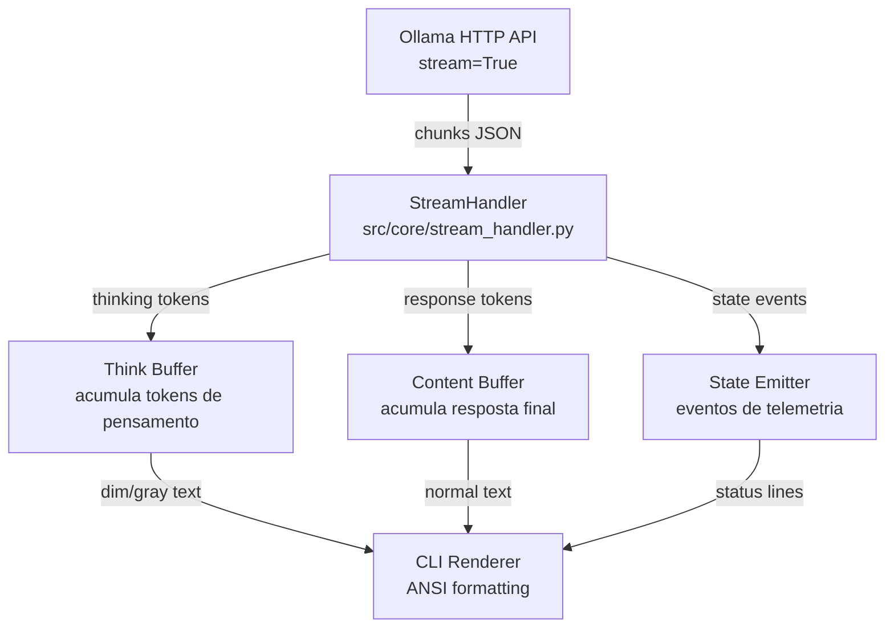

# 🟣 BLUEPRINT: FASE 1 — VISIBILIDADE DO PENSAMENTO (STREAMING DE ESTADO)

---

## 1. DIAGNÓSTICO DO ESTADO ATUAL

### O Problema Identificado

O `OllamaProvider.generate()` atual já faz streaming (`stream=True`), mas apresenta **três falhas críticas de UX**:

1. **Pensamento misturado com resposta:** Modelos com reasoning (DeepSeek-R1, Qwen3) emitem blocos `<think>...</think>` que são impressos diretamente no stdout junto com o conteúdo final — o usuário vê tudo misturado.

2. **Zero telemetria de estado:** O Controller e o DebateEngine executam operações sequenciais sem emitir sinais intermediários. Quando o modelo demora 30-60s, o terminal fica "morto".

3. **Resposta retornada contém pensamento:** O `full_response` acumula tudo (think + content), poluindo o histórico de conversação e o relatório `.md`.

### Ponto de Interceptação Identificado

A API do Ollama com `stream=True` retorna chunks JSON linha a linha. Quando o modelo suporta reasoning, o JSON inclui campos distintos:

```json
// Ollama API response com thinking habilitado:
{"model":"qwen3","response":"","thinking":"Let me analyze this...","done":false}
{"model":"qwen3","response":"","thinking":"The architecture needs...","done":false}
{"model":"qwen3","response":"Here is my analysis:","thinking":"","done":false}
{"model":"qwen3","response":" The system should...","thinking":"","done":false}
```

**Alternativa para modelos sem campo `thinking` separado:** O pensamento vem inline como `<think>...</think>` dentro do campo `response`. Precisamos cobrir ambos os cenários.

---

## 2. ARQUITETURA DA SOLUÇÃO



### Arquivos Modificados/Criados

| Arquivo | Ação | Responsabilidade |
|---|---|---|
| `src/core/stream_handler.py` | **CRIAR** | Parser de stream, buffer de pensamento, emissão de eventos |
| `src/models/ollama_provider.py` | **MODIFICAR** | Integrar StreamHandler, separar thinking de content |
| `src/models/model_provider.py` | **MODIFICAR** | Expandir contrato `generate()` para retornar resultado estruturado |
| `src/core/controller.py` | **MODIFICAR** | Emitir eventos de estado nas transições do pipeline |
| `src/debate/debate_engine.py` | **MODIFICAR** | Emitir eventos de estado por round |
| `src/cli/main.py` | **MODIFICAR** | Renderização ANSI para pensamento dimmed |

### Arquivos NÃO Alterados
- `src/agents/critic_agent.py`
- `src/agents/proponent_agent.py`  
- `src/planning/plan_generator.py`
- `src/conversation/conversation_manager.py`
- `src/config/settings.py`
- `tests/*` (testes serão adicionados ao final)

---

## 3. CÓDIGO DE IMPLEMENTAÇÃO

### 3.1 — `src/core/stream_handler.py` (NOVO)

```python
"""
stream_handler.py — Módulo de interceptação e buffering de tokens de streaming.

Responsabilidades:
1. Parsear chunks JSON do Ollama stream
2. Separar tokens de pensamento (thinking) de tokens de conteúdo (response)
3. Detectar blocos <think>...</think> inline para modelos sem campo 'thinking' separado
4. Emitir eventos de estado para a CLI
5. Renderizar output formatado com diferenciação visual ANSI

NÃO contém lógica de negócio. NÃO conhece agentes. Apenas processa stream.
"""

import sys
import re
from enum import Enum
from typing import NamedTuple, Optional, Callable
from dataclasses import dataclass, field


class TokenType(Enum):
    """Classificação de cada token recebido do stream."""
    THINKING = "thinking"
    CONTENT = "content"
    STATE = "state"


class StreamResult(NamedTuple):
    """Resultado estruturado do processamento de stream completo."""
    thinking: str       # Buffer completo de pensamento (para log/debug)
    content: str        # Resposta final limpa (para histórico e relatório)
    raw: str            # Stream bruto completo (para diagnóstico)


class StateEvent:
    """Evento de telemetria emitido durante o processamento."""
    def __init__(self, event_type: str, message: str, metadata: dict = None):
        self.event_type = event_type
        self.message = message
        self.metadata = metadata or {}

    def __repr__(self):
        return f"[STATE: {self.event_type}] {self.message}"


# ─── ANSI Color Codes ───────────────────────────────────────
class ANSIStyle:
    """Códigos ANSI para formatação de terminal."""
    RESET = "\033[0m"
    DIM = "\033[2m"            # Texto dimmed/cinza para pensamento
    DIM_ITALIC = "\033[2;3m"   # Dimmed + itálico
    CYAN = "\033[36m"          # Para labels de estado
    YELLOW = "\033[33m"        # Para avisos
    GREEN = "\033[32m"         # Para confirmações
    BLUE = "\033[34m"          # Para informações de agente
    BOLD = "\033[1m"           # Para headers
    GRAY = "\033[90m"          # Cinza explícito


@dataclass
class InlineThinkParser:
    """
    Parser de estado para detectar blocos <think>...</think> inline.
    
    Modelos sem campo 'thinking' separado emitem pensamento dentro do
    campo 'response' usando tags XML. Este parser rastreia se estamos
    dentro ou fora de um bloco <think>.
    
    Máquina de estados:
        OUTSIDE -> encontra '<think>' -> INSIDE
        INSIDE  -> encontra '</think>' -> OUTSIDE
    """
    inside_think: bool = False
    think_buffer: str = ""
    content_buffer: str = ""
    # Buffer parcial para detectar tags fragmentadas entre chunks
    _partial_tag_buffer: str = ""

    def process_chunk(self, chunk: str) -> tuple:
        """
        Processa um chunk de texto e separa pensamento de conteúdo.
        
        Returns:
            (think_text, content_text) — texto a ser exibido em cada canal
        """
        # Concatenar com buffer parcial de tag anterior
        text = self._partial_tag_buffer + chunk
        self._partial_tag_buffer = ""

        think_output = ""
        content_output = ""

        while text:
            if self.inside_think:
                # Procurar fim do bloco de pensamento
                end_idx = text.find("</think>")
                if end_idx != -1:
                    # Encontrou fechamento
                    think_part = text[:end_idx]
                    think_output += think_part
                    self.think_buffer += think_part
                    text = text[end_idx + len("</think>"):]
                    self.inside_think = False
                else:
                    # Verificar se temos uma tag parcial no final
                    # Ex: chunk termina com "</thi" — pode ser início de </think>
                    partial_match = self._check_partial_close_tag(text)
                    if partial_match is not None:
                        # Guardar o sufixo parcial para o próximo chunk
                        safe_text = text[:partial_match]
                        self._partial_tag_buffer = text[partial_match:]
                        think_output += safe_text
                        self.think_buffer += safe_text
                        text = ""
                    else:
                        think_output += text
                        self.think_buffer += text
                        text = ""
            else:
                # Procurar início de bloco de pensamento
                start_idx = text.find("<think>")
                if start_idx != -1:
                    # Conteúdo antes da tag
                    content_part = text[:start_idx]
                    content_output += content_part
                    self.content_buffer += content_part
                    text = text[start_idx + len("<think>"):]
                    self.inside_think = True
                else:
                    # Verificar tag parcial de abertura no final
                    partial_match = self._check_partial_open_tag(text)
                    if partial_match is not None:
                        safe_text = text[:partial_match]
                        self._partial_tag_buffer = text[partial_match:]
                        content_output += safe_text
                        self.content_buffer += safe_text
                        text = ""
                    else:
                        content_output += text
                        self.content_buffer += text
                        text = ""

        return think_output, content_output

    def _check_partial_open_tag(self, text: str) -> Optional[int]:
        """Verifica se o final do texto pode ser início de '<think>'."""
        tag = "<think>"
        for i in range(1, len(tag)):
            if text.endswith(tag[:i]):
                return len(text) - i
        return None

    def _check_partial_close_tag(self, text: str) -> Optional[int]:
        """Verifica se o final do texto pode ser início de '</think>'."""
        tag = "</think>"
        for i in range(1, len(tag)):
            if text.endswith(tag[:i]):
                return len(text) - i
        return None


class StreamHandler:
    """
    Gerenciador principal de stream do LLM.
    
    Processa chunks do Ollama API e:
    1. Separa pensamento de conteúdo (via campo 'thinking' OU tags inline)
    2. Renderiza em tempo real com formatação visual diferenciada
    3. Emite eventos de estado
    
    Uso:
        handler = StreamHandler(show_thinking=True)
        result = handler.process_ollama_stream(response_iterator)
        # result.content contém apenas a resposta limpa
        # result.thinking contém o raciocínio capturado
    """

    def __init__(self, show_thinking: bool = True, 
                 state_callback: Callable[[StateEvent], None] = None):
        """
        Args:
            show_thinking: Se True, exibe pensamento em estilo dimmed. 
                          Se False, suprime completamente.
            state_callback: Função chamada quando um evento de estado é emitido.
        """
        self.show_thinking = show_thinking
        self.state_callback = state_callback
        self._inline_parser = InlineThinkParser()
        self._thinking_header_shown = False
        self._content_header_shown = False
        self._has_thinking_content = False

    def emit_state(self, event_type: str, message: str, metadata: dict = None):
        """Emite um evento de estado para a CLI."""
        event = StateEvent(event_type, message, metadata or {})
        if self.state_callback:
            self.state_callback(event)
        else:
            # Fallback: imprimir diretamente
            sys.stdout.write(
                f"\n{ANSIStyle.CYAN}⚡ {event.message}{ANSIStyle.RESET}\n"
            )
            sys.stdout.flush()

    def process_ollama_stream(self, line_iterator) -> StreamResult:
        """
        Processa o stream completo do Ollama e retorna resultado estruturado.
        
        Args:
            line_iterator: Iterator de linhas bytes da resposta HTTP streaming.
            
        Returns:
            StreamResult com thinking, content e raw separados.
        """
        import json

        full_thinking = ""
        full_content = ""
        full_raw = ""
        has_native_thinking = False  # Flag: modelo usa campo 'thinking' nativo

        for line in line_iterator:
            if not line:
                continue
            try:
                data = json.loads(line.decode('utf-8'))
            except (json.JSONDecodeError, UnicodeDecodeError):
                continue

            # ── Estratégia 1: Campo 'thinking' nativo do Ollama ──
            thinking_chunk = data.get("thinking", "")
            response_chunk = data.get("response", "")

            if thinking_chunk:
                has_native_thinking = True
                full_thinking += thinking_chunk
                full_raw += thinking_chunk
                self._render_thinking_chunk(thinking_chunk)

            if response_chunk:
                if has_native_thinking:
                    # Modelo tem campo nativo — response é conteúdo limpo
                    if not self._content_header_shown and self._has_thinking_content:
                        self._transition_to_content()
                    full_content += response_chunk
                    full_raw += response_chunk
                    self._render_content_chunk(response_chunk)
                else:
                    # ── Estratégia 2: Parse inline de <think> tags ──
                    full_raw += response_chunk
                    think_part, content_part = self._inline_parser.process_chunk(
                        response_chunk
                    )
                    if think_part:
                        full_thinking += think_part
                        self._render_thinking_chunk(think_part)
                    if content_part:
                        if not self._content_header_shown and self._has_thinking_content:
                            self._transition_to_content()
                        full_content += content_part
                        self._render_content_chunk(content_part)

            # Verificar se o stream terminou
            if data.get("done", False):
                break

        # Finalizar renderização
        self._finalize_render()

        # Se não houve campo nativo e nem tags inline, o content é o raw
        if not has_native_thinking and not self._inline_parser.think_buffer:
            full_content = full_raw
            full_thinking = ""

        return StreamResult(
            thinking=full_thinking.strip(),
            content=full_content.strip(),
            raw=full_raw.strip()
        )

    def _render_thinking_chunk(self, chunk: str):
        """Renderiza um chunk de pensamento com estilo visual dimmed."""
        if not self.show_thinking:
            return

        if not self._thinking_header_shown:
            sys.stdout.write(
                f"\n{ANSIStyle.GRAY}{'─' * 40}{ANSIStyle.RESET}\n"
                f"{ANSIStyle.DIM_ITALIC}💭 Raciocínio interno:{ANSIStyle.RESET}\n"
                f"{ANSIStyle.DIM}"
            )
            sys.stdout.flush()
            self._thinking_header_shown = True
            self._has_thinking_content = True

        sys.stdout.write(f"{ANSIStyle.DIM}{chunk}{ANSIStyle.RESET}")
        sys.stdout.flush()

    def _transition_to_content(self):
        """Renderiza a transição visual de pensamento para conteúdo."""
        sys.stdout.write(
            f"{ANSIStyle.RESET}\n"
            f"{ANSIStyle.GRAY}{'─' * 40}{ANSIStyle.RESET}\n"
            f"{ANSIStyle.GREEN}✅ Resposta:{ANSIStyle.RESET}\n"
        )
        sys.stdout.flush()
        self._content_header_shown = True

    def _render_content_chunk(self, chunk: str):
        """Renderiza um chunk de conteúdo final (estilo normal)."""
        sys.stdout.write(chunk)
        sys.stdout.flush()

    def _finalize_render(self):
        """Limpa estado visual ao fim do stream."""
        sys.stdout.write(f"{ANSIStyle.RESET}\n")
        sys.stdout.flush()

    def reset(self):
        """Reset do handler para reutilização."""
        self._inline_parser = InlineThinkParser()
        self._thinking_header_shown = False
        self._content_header_shown = False
        self._has_thinking_content = False
```

---

### 3.2 — `src/models/model_provider.py` (MODIFICADO)

```python
"""
model_provider.py — Interface base para todos os LLM providers.

MUDANÇA FASE 1: Adicionado GenerationResult como tipo de retorno estruturado.
O contrato generate() continua retornando str para manter compatibilidade,
mas generate_with_thinking() retorna resultado estruturado.
"""

from abc import ABC, abstractmethod
from typing import NamedTuple, Optional


class GenerationResult(NamedTuple):
    """Resultado estruturado de uma geração de LLM."""
    content: str          # Resposta final limpa
    thinking: str         # Raciocínio capturado (vazio se não disponível)
    raw: str              # Output bruto completo


class ModelProvider(ABC):
    """
    Interface base for all LLM providers (Local and Cloud).
    """

    @abstractmethod
    def generate(self, prompt: str, context: list = None, role: str = "user") -> str:
        """
        Generates text based on prompt and conversation context.
        Returns clean content string (backward compatible).
        """
        pass

    def generate_with_thinking(self, prompt: str, context: list = None, 
                                role: str = "user") -> GenerationResult:
        """
        Generates text and returns structured result with thinking separated.
        Default implementation wraps generate() for providers that don't support thinking.
        """
        content = self.generate(prompt, context, role)
        return GenerationResult(content=content, thinking="", raw=content)
```

---

### 3.3 — `src/models/ollama_provider.py` (MODIFICADO)

```python
"""
ollama_provider.py — Provider local usando Ollama HTTP API.

MUDANÇA FASE 1: 
- Integração com StreamHandler para separar thinking de content
- generate() retorna apenas content limpo (sem poluição de <think> tags)
- generate_with_thinking() retorna resultado estruturado completo
- Emissão de eventos de estado durante o streaming
"""

import requests
import json
import sys
from src.models.model_provider import ModelProvider, GenerationResult
from src.config.settings import OLLAMA_ENDPOINT, MODEL_NAME
from src.core.stream_handler import StreamHandler, ANSIStyle


class OllamaProvider(ModelProvider):
    """
    Local LLM provider using Ollama HTTP API.
    """

    def __init__(self, model_name: str = MODEL_NAME, 
                 endpoint: str = OLLAMA_ENDPOINT, 
                 think: bool = False,
                 show_thinking: bool = True):
        self.model_name = model_name
        self.endpoint = endpoint
        self.think = think
        self.show_thinking = show_thinking

    def generate(self, prompt: str, context: list = None, role: str = "user") -> str:
        """
        Gera resposta e retorna apenas o conteúdo limpo (sem pensamento).
        Mantém compatibilidade com contrato original.
        """
        result = self.generate_with_thinking(prompt, context, role)
        return result.content

    def generate_with_thinking(self, prompt: str, context: list = None, 
                                role: str = "user") -> GenerationResult:
        """
        Gera resposta com streaming visual e retorna resultado estruturado.
        O pensamento é exibido em tempo real (dimmed) mas separado do content.
        """
        payload = {
            "model": self.model_name,
            "prompt": prompt,
            "stream": True,
        }

        # Habilitar thinking no Ollama se o modelo suporta
        if self.think:
            payload["options"] = {"think": True}

        try:
            # Emitir estado: início da geração
            sys.stdout.write(
                f"{ANSIStyle.CYAN}⏳ Gerando com {self.model_name}...{ANSIStyle.RESET}\n"
            )
            sys.stdout.flush()

            response = requests.post(
                self.endpoint, json=payload, timeout=120, stream=True
            )
            response.raise_for_status()

            # Delegar processamento ao StreamHandler
            handler = StreamHandler(show_thinking=self.show_thinking)
            result = handler.process_ollama_stream(response.iter_lines())

            return GenerationResult(
                content=result.content,
                thinking=result.thinking,
                raw=result.raw
            )

        except requests.exceptions.RequestException as e:
            error_msg = f"Error communicating with Ollama: {str(e)}"
            return GenerationResult(content=error_msg, thinking="", raw=error_msg)
```

---

### 3.4 — `src/models/cloud_provider.py` (MODIFICADO — mínimo)

```python
"""
cloud_provider.py — Cloud LLM provider (Mock/Skeleton).

MUDANÇA FASE 1: Implementa generate_with_thinking() via herança padrão.
Nenhuma lógica alterada. O método herdado de ModelProvider já funciona.
"""

import os
from src.models.model_provider import ModelProvider
from src.config.settings import LLM_API_KEY, MODEL_NAME


class CloudProvider(ModelProvider):
    """
    Cloud LLM provider (Mock/Skeleton for APIs like OpenAI, Anthropic, etc).
    """

    def __init__(self, api_key: str = LLM_API_KEY, model_name: str = MODEL_NAME):
        self.api_key = api_key
        self.model_name = model_name

    def generate(self, prompt: str, context: list = None, role: str = "user") -> str:
        if not self.api_key:
            return "Error: LLM_API_KEY environment variable is not set."

        # Mocking cloud API response for MVP
        return f"[Cloud Provider {self.model_name}] Response to: {prompt[:50]}..."
```

---

### 3.5 — `src/core/controller.py` (MODIFICADO)

```python
"""
controller.py — Orquestrador do fluxo completo IdeaForge.

MUDANÇA FASE 1: Adição de emissão de eventos de estado (telemetria)
em cada transição do pipeline. Nenhuma lógica de decisão alterada.
"""

import sys
from src.conversation.conversation_manager import ConversationManager
from src.agents.critic_agent import CriticAgent
from src.agents.proponent_agent import ProponentAgent
from src.debate.debate_engine import DebateEngine
from src.planning.plan_generator import PlanGenerator
from src.models.model_provider import ModelProvider
from src.core.stream_handler import ANSIStyle


def emit_pipeline_state(state: str, detail: str = ""):
    """
    Emite um evento de estado visual para o terminal.
    Formato padronizado para todas as transições do pipeline.
    """
    state_icons = {
        "PIPELINE_START": "🚀",
        "CRITIC_ANALYSIS": "🔍",
        "REFINEMENT_LOOP": "🔄",
        "USER_APPROVAL": "✋",
        "DEBATE_START": "⚔️",
        "DEBATE_ROUND": "🔁",
        "PLAN_GENERATION": "📋",
        "PIPELINE_COMPLETE": "✅",
        "AGENT_THINKING": "💭",
    }
    icon = state_icons.get(state, "⚡")
    detail_str = f" — {detail}" if detail else ""
    sys.stdout.write(
        f"\n{ANSIStyle.CYAN}{ANSIStyle.BOLD}"
        f"[{icon} {state}]{detail_str}"
        f"{ANSIStyle.RESET}\n"
    )
    sys.stdout.flush()


class AgentController:
    """
    Orquestra o fluxo completo do sistema IdeaForge.
    """

    def __init__(self, provider: ModelProvider):
        self.provider = provider
        self.conversation = ConversationManager()
        self.critic = CriticAgent(provider)
        self.proponent = ProponentAgent(provider)
        self.debate_engine = DebateEngine(self.proponent, self.critic, rounds=3)
        self.plan_generator = PlanGenerator(provider)

    def run_pipeline(self, initial_idea: str, report_filename: str = None) -> str:
        """
        Executes the main pipeline:
        1. Critic Analysis
        2. Refinement Loop
        3. Debate
        4. Plan Generation
        """
        # Step 1: Initial conversation
        emit_pipeline_state("PIPELINE_START", "Iniciando pipeline de análise")
        self.conversation.add_message("user", f"My initial idea is: {initial_idea}")

        from src.cli.main import display_response, ask_approval

        # Refinement Loop
        while True:
            emit_pipeline_state("CRITIC_ANALYSIS", 
                              "Enviando ideia para análise do Agente Crítico")
            
            critique = self.critic.analyze(initial_idea, self.conversation)

            display_response("Critic Agent", critique)
            self.conversation.add_message("critic", critique)

            # Step 2: User Approval
            emit_pipeline_state("USER_APPROVAL", "Aguardando decisão do usuário")
            approved = ask_approval()
            if approved:
                emit_pipeline_state("USER_APPROVAL", "Ideia aprovada — avançando para debate")
                break
            else:
                emit_pipeline_state("REFINEMENT_LOOP", 
                                  "Usuário solicitou refinamento")
                print("\nPor favor, responda aos pontos levantados ou explique melhor a ideia:")
                user_refinement = input("> ")
                if not user_refinement:
                    print("[Sistema] Refinamento vazio. Encerrando o pipeline.")
                    sys.exit(0)

                self.conversation.add_message("user", user_refinement)
                # Keep looping

        # Step 3: Debate
        emit_pipeline_state("DEBATE_START", 
                          f"Iniciando debate estruturado — {self.debate_engine.num_rounds} rounds")
        debate_result = self.debate_engine.run(initial_idea, report_filename)

        # Step 4: Plan Generation
        emit_pipeline_state("PLAN_GENERATION", 
                          "Sintetizando plano de desenvolvimento técnico")
        final_plan = self.plan_generator.generate_plan(debate_result, initial_idea)

        if report_filename:
            with open(report_filename, "a", encoding="utf-8") as f:
                f.write("\n# 📋 Plano de Desenvolvimento Técnico Final\n\n")
                f.write(final_plan + "\n")

        emit_pipeline_state("PIPELINE_COMPLETE", "Pipeline concluído com sucesso")
        return final_plan
```

---

### 3.6 — `src/debate/debate_engine.py` (MODIFICADO)

```python
"""
debate_engine.py — Motor de debate estruturado entre agentes.

MUDANÇA FASE 1: Emissão de eventos de estado por round de debate.
Nenhuma lógica de debate alterada. Apenas visibilidade adicionada.
"""

from typing import Dict, Any
from src.agents.critic_agent import CriticAgent
from src.agents.proponent_agent import ProponentAgent
from src.core.stream_handler import ANSIStyle


class DebateEngine:
    """
    Executa o debate estruturado entre o Agente Proponente e o Agente Crítico.
    """

    def __init__(self, proponent: ProponentAgent, critic: CriticAgent, rounds: int = 3):
        self.proponent = proponent
        self.critic = critic
        self.num_rounds = rounds
        self.debate_transcript = []

    def run(self, refined_idea: str, report_filename: str = None) -> str:
        """
        Executa os ciclos de debate alternados.
        """
        print(
            f"\n{ANSIStyle.BOLD}{ANSIStyle.YELLOW}"
            f"{'═' * 50}\n"
            f"  ⚔️  INICIANDO DEBATE ESTRUTURADO "
            f"({self.num_rounds} rounds)\n"
            f"{'═' * 50}"
            f"{ANSIStyle.RESET}"
        )

        context_accumulator = f"Initial Idea: {refined_idea}\n\n"

        for r in range(1, self.num_rounds + 1):
            # ── Round Header ──
            print(
                f"\n{ANSIStyle.BOLD}{ANSIStyle.BLUE}"
                f"┌{'─' * 48}┐\n"
                f"│  Round {r}/{self.num_rounds}                                      │\n"
                f"└{'─' * 48}┘"
                f"{ANSIStyle.RESET}"
            )

            # ── Proponent turn ──
            print(
                f"\n{ANSIStyle.BOLD}{ANSIStyle.GREEN}"
                f"🛡️  PROPONENTE — formulando defesa arquitetural..."
                f"{ANSIStyle.RESET}"
            )
            prop_response = self.proponent.propose(refined_idea, context_accumulator)

            self.debate_transcript.append(f"Proponente:\n{prop_response}")
            context_accumulator += f"Proponent Proposal:\n{prop_response}\n\n"

            if report_filename:
                with open(report_filename, "a", encoding="utf-8") as f:
                    f.write(f"\n## 🛡️ Agente: PROPONENTE (Round {r})\n")
                    f.write(prop_response + "\n\n---\n")

            # ── Critic turn ──
            print(
                f"\n{ANSIStyle.BOLD}{ANSIStyle.YELLOW}"
                f"⚡ CRÍTICO — analisando vulnerabilidades e lacunas..."
                f"{ANSIStyle.RESET}"
            )

            # Mocking history to reuse critic analyze signature
            class MockHistory:
                def get_context_string(self):
                    return context_accumulator
                def get_history(self):
                    return []

            crit_response = self.critic.analyze(refined_idea, MockHistory())

            self.debate_transcript.append(f"Crítico:\n{crit_response}")
            context_accumulator += f"Critic Critique:\n{crit_response}\n\n"

            if report_filename:
                with open(report_filename, "a", encoding="utf-8") as f:
                    f.write(f"\n## ⚡ Agente: CRÍTICO (Round {r})\n")
                    f.write(crit_response + "\n\n---\n")

        print(
            f"\n{ANSIStyle.BOLD}{ANSIStyle.GREEN}"
            f"{'═' * 50}\n"
            f"  ✅ DEBATE CONCLUÍDO — {self.num_rounds} rounds completos\n"
            f"{'═' * 50}"
            f"{ANSIStyle.RESET}\n"
        )
        return "\n\n".join(self.debate_transcript)
```

---

### 3.7 — `src/cli/main.py` (MODIFICADO)

```python
"""
main.py — Interface CLI do IdeaForge.

MUDANÇA FASE 1: 
- display_response() usa formatação ANSI aprimorada
- Adicionado show_thinking_preference para controle de exibição
- get_provider() passa show_thinking para o OllamaProvider
"""

import sys
import os
import datetime

sys.path.insert(0, os.path.abspath(os.path.join(os.path.dirname(__file__), '../..')))


def prompt_idea() -> str:
    print("\n" + "=" * 50)
    print(" 💡 IdeaForge CLI - Conversor de Ideias em Planos")
    print("=" * 50)
    print("\nPor favor, descreva a sua ideia de projeto de software:")

    lines = []
    while True:
        try:
            line = input("> ")
            if not line:
                break
            lines.append(line)
        except EOFError:
            break

    return "\n".join(lines).strip()


def display_response(role: str, content: str):
    """
    Exibe resposta de um agente com formatação ANSI.
    O conteúdo aqui já está LIMPO (sem blocos de pensamento).
    """
    from src.core.stream_handler import ANSIStyle

    role_styles = {
        "critic agent": (ANSIStyle.YELLOW, "⚡"),
        "proponent agent": (ANSIStyle.GREEN, "🛡️"),
        "planner": (ANSIStyle.BLUE, "📋"),
    }
    style, icon = role_styles.get(role.lower(), (ANSIStyle.CYAN, "🤖"))

    print(f"\n{style}{ANSIStyle.BOLD}--- [{icon} {role.upper()}] ---{ANSIStyle.RESET}")
    print(content)
    print(f"{style}{'─' * 25}{ANSIStyle.RESET}")


def ask_approval() -> bool:
    while True:
        choice = input(
            "\nAprovar ideia refinada para o debate de agentes? (s/n): "
        ).strip().lower()
        if choice in ['s', 'sim', 'y', 'yes']:
            return True
        elif choice in ['n', 'nao', 'não', 'no']:
            return False
        else:
            print("Resposta inválida. Digite 's' ou 'n'.")


from src.config.settings import LLM_PROVIDER, MODEL_NAME
from src.models.ollama_provider import OllamaProvider
from src.models.cloud_provider import CloudProvider
from src.core.controller import AgentController
import requests


def select_model():
    print("\n 🔎 Buscando modelos locais no Ollama...")
    try:
        response = requests.get("http://localhost:11434/api/tags", timeout=5)
        response.raise_for_status()
        models = response.json().get("models", [])

        if not models:
            print("Nenhum modelo encontrado no Ollama. Usando o padrão.")
            return MODEL_NAME, False

        print("\nModelos Disponíveis:")
        for i, model in enumerate(models):
            print(f"[{i + 1}] {model['name']}")

        while True:
            choice = input(
                f"\nEscolha o modelo (1-{len(models)}) ou Enter para o padrão ({MODEL_NAME}): "
            )
            if not choice.strip():
                selected_model = MODEL_NAME
                break

            try:
                idx = int(choice) - 1
                if 0 <= idx < len(models):
                    selected_model = models[idx]['name']
                    break
                print("Opção inválida.")
            except ValueError:
                print("Por favor, digite um número válido.")

        # Ask for Deep Thinking if the model supports it
        reasoning_keywords = ["qwen", "deepseek", "reasoning", "r1"]
        think_preference = False
        if any(keyword in selected_model.lower() for keyword in reasoning_keywords):
            while True:
                think_choice = input(
                    f"\nEste modelo ({selected_model}) suporta pensamento profundo "
                    f"(Reasoning). Deseja ativar? (s/n): "
                ).strip().lower()
                if think_choice in ['s', 'sim', 'y', 'yes']:
                    think_preference = True
                    print("🧠 Pensamento profundo ativado.")
                    break
                elif think_choice in ['n', 'nao', 'não', 'no']:
                    print("⚡ Pensamento profundo desativado.")
                    break
                else:
                    print("Resposta inválida. Digite 's' ou 'n'.")

        return selected_model, think_preference

    except Exception as e:
        print(f"⚠️ Não foi possível carregar os modelos do Ollama: {str(e)}")
        print(f"Iremos usar a variável de ambiente: {MODEL_NAME}")
        return MODEL_NAME, False


def get_provider(selected_model: str, think_preference: bool):
    if LLM_PROVIDER.lower() == "ollama":
        return OllamaProvider(
            model_name=selected_model,
            think=think_preference,
            show_thinking=think_preference  # Mostrar pensamento apenas se ativado
        )
    else:
        return CloudProvider(model_name=selected_model)


def main():
    selected_model, think_preference = select_model()

    idea = prompt_idea()
    if not idea:
        print("Nenhuma ideia inserida. Encerrando.")
        sys.exit(0)

    provider = get_provider(selected_model, think_preference)
    controller = AgentController(provider)

    timestamp = datetime.datetime.now().strftime("%Y%m%d_%H%M%S")
    report_filename = f"debate_RELATORIO_{timestamp}.md"

    with open(report_filename, "w", encoding="utf-8") as f:
        f.write(
            f"# 📋 Relatório de Debate IdeaForge - "
            f"{datetime.datetime.now().strftime('%d/%m/%Y %H:%M:%S')}\n\n"
        )
        f.write(f"**Ideia Inicial:**\n{idea}\n\n---\n")

    try:
        final_plan = controller.run_pipeline(idea, report_filename)

        print("\n" + "=" * 50)
        print("  🏆 PLANO DE DESENVOLVIMENTO FINALIZADO  ")
        print("=" * 50 + "\n")
        print(final_plan)
        print("\n" + "=" * 50)

    except Exception as e:
        print(f"\n❌ Erro durante a execução do pipeline: {str(e)}")
        sys.exit(1)


if __name__ == "__main__":
    main()
```

---

## 4. EXEMPLO DE OUTPUT VISUAL ESPERADO

```
🔎 Buscando modelos locais no Ollama...

Modelos Disponíveis:
[1] qwen3:8b
[2] llama3:8b

Escolha o modelo (1-2): 1

Este modelo (qwen3:8b) suporta pensamento profundo (Reasoning). Deseja ativar? (s/n): s
🧠 Pensamento profundo ativado.

[🚀 PIPELINE_START] — Iniciando pipeline de análise

[🔍 CRITIC_ANALYSIS] — Enviando ideia para análise do Agente Crítico
⏳ Gerando com qwen3:8b...

────────────────────────────────────────
💭 Raciocínio interno:
The user wants to build a task management system. Let me analyze 
the architectural gaps... The idea mentions "real-time sync" but 
doesn't specify the protocol. WebSocket? SSE? Also, there's no 
mention of conflict resolution for concurrent edits. The data 
model seems flat — no hierarchy for sub-tasks...
────────────────────────────────────────
✅ Resposta:

## Análise Crítica

1. **Protocolo de sincronização não definido** — Você menciona 
   "sync em tempo real" mas não especifica WebSocket vs SSE...
2. **Resolução de conflitos ausente** — O que acontece quando 
   dois usuários editam a mesma tarefa?
...

--- [⚡ CRITIC AGENT] ---
[conteúdo limpo repetido para formatação de agente]
─────────────────────────

[✋ USER_APPROVAL] — Aguardando decisão do usuário
Aprovar ideia refinada para o debate de agentes? (s/n): s

[⚔️ DEBATE_START] — Iniciando debate estruturado — 3 rounds
══════════════════════════════════════════════════════
  ⚔️  INICIANDO DEBATE ESTRUTURADO (3 rounds)
══════════════════════════════════════════════════════

┌────────────────────────────────────────────────┐
│  Round 1/3                                      │
└────────────────────────────────────────────────┘

🛡️  PROPONENTE — formulando defesa arquitetural...
⏳ Gerando com qwen3:8b...

────────────────────────────────────────
💭 Raciocínio interno:
I need to address the sync protocol concern. WebSocket is the 
right choice here because... Let me also propose a CRDT-based 
conflict resolution strategy...
────────────────────────────────────────
✅ Resposta:

## Proposta Arquitetural
Proponho WebSocket com fallback para SSE...
```

---

## 5. TESTES UNITÁRIOS

### `tests/test_stream_handler.py` (NOVO)

```python
"""
test_stream_handler.py — Testes para o módulo de streaming e buffering.
"""

import pytest
import json
from src.core.stream_handler import (
    StreamHandler, InlineThinkParser, StreamResult, ANSIStyle
)


class TestInlineThinkParser:
    """Testes para o parser de tags <think> inline."""

    def test_no_think_tags(self):
        parser = InlineThinkParser()
        think, content = parser.process_chunk("Hello world")
        assert think == ""
        assert content == "Hello world"

    def test_complete_think_block(self):
        parser = InlineThinkParser()
        think, content = parser.process_chunk(
            "<think>reasoning here</think>actual response"
        )
        assert think == "reasoning here"
        assert content == "actual response"

    def test_think_across_multiple_chunks(self):
        parser = InlineThinkParser()

        t1, c1 = parser.process_chunk("<think>start of ")
        assert t1 == "start of "
        assert c1 == ""

        t2, c2 = parser.process_chunk("thinking</think>content here")
        assert t2 == "thinking"
        assert c2 == "content here"

    def test_content_before_think(self):
        parser = InlineThinkParser()
        think, content = parser.process_chunk(
            "prefix<think>thought</think>suffix"
        )
        assert think == "thought"
        assert content == "prefixsuffix"

    def test_multiple_think_blocks(self):
        parser = InlineThinkParser()
        think, content = parser.process_chunk(
            "<think>t1</think>c1<think>t2</think>c2"
        )
        assert think == "t1t2"
        assert content == "c1c2"

    def test_fragmented_open_tag(self):
        """Tag <think> dividida entre dois chunks."""
        parser = InlineThinkParser()
        t1, c1 = parser.process_chunk("hello<thi")
        # O parser deve reter "<thi" como possível início de tag
        t2, c2 = parser.process_chunk("nk>inside</think>after")
        
        assert parser.content_buffer == "helloafter"
        assert parser.think_buffer == "inside"

    def test_fragmented_close_tag(self):
        """Tag </think> dividida entre dois chunks."""
        parser = InlineThinkParser()
        t1, c1 = parser.process_chunk("<think>thought</thi")
        t2, c2 = parser.process_chunk("nk>content")
        
        assert parser.think_buffer == "thought"
        assert parser.content_buffer == "content"


class TestStreamHandler:
    """Testes para o StreamHandler principal."""

    def _make_line_iterator(self, chunks):
        """Helper: cria um iterador de linhas JSON simulando o Ollama."""
        for chunk in chunks:
            yield json.dumps(chunk).encode('utf-8')

    def test_native_thinking_field(self):
        """Modelo com campo 'thinking' nativo no JSON."""
        chunks = [
            {"thinking": "Let me analyze...", "response": "", "done": False},
            {"thinking": "The architecture...", "response": "", "done": False},
            {"thinking": "", "response": "Here is my ", "done": False},
            {"thinking": "", "response": "analysis.", "done": True},
        ]
        handler = StreamHandler(show_thinking=False)  # Suprimir output no teste
        result = handler.process_ollama_stream(self._make_line_iterator(chunks))

        assert result.thinking == "Let me analyze...The architecture..."
        assert result.content == "Here is my analysis."

    def test_inline_think_tags(self):
        """Modelo sem campo nativo — usa tags <think> inline."""
        chunks = [
            {"response": "<think>reasoning", "done": False},
            {"response": " step</think>", "done": False},
            {"response": "Final answer", "done": True},
        ]
        handler = StreamHandler(show_thinking=False)
        result = handler.process_ollama_stream(self._make_line_iterator(chunks))

        assert result.thinking == "reasoning step"
        assert result.content == "Final answer"

    def test_no_thinking_at_all(self):
        """Modelo sem nenhum pensamento — tudo é conteúdo."""
        chunks = [
            {"response": "Direct ", "done": False},
            {"response": "response.", "done": True},
        ]
        handler = StreamHandler(show_thinking=False)
        result = handler.process_ollama_stream(self._make_line_iterator(chunks))

        assert result.thinking == ""
        assert result.content == "Direct response."

    def test_empty_stream(self):
        """Stream vazio não causa erro."""
        handler = StreamHandler(show_thinking=False)
        result = handler.process_ollama_stream(iter([]))
        assert result.content == ""
        assert result.thinking == ""

    def test_malformed_json_skipped(self):
        """Linhas JSON malformadas são ignoradas."""
        lines = [
            b'{"response": "valid", "done": false}',
            b'not json at all',
            b'{"response": " end", "done": true}',
        ]
        handler = StreamHandler(show_thinking=False)
        result = handler.process_ollama_stream(iter(lines))
        assert result.content == "valid end"
```

---

## 6. MATRIZ DE RASTREABILIDADE

| Requisito | Componente | Arquivo | Método | Teste |
|---|---|---|---|---|
| Separar thinking de content (campo nativo) | StreamHandler | `stream_handler.py` | `process_ollama_stream()` | `test_native_thinking_field` |
| Separar thinking de content (tags inline) | InlineThinkParser | `stream_handler.py` | `process_chunk()` | `test_inline_think_tags` |
| Tags fragmentadas entre chunks | InlineThinkParser | `stream_handler.py` | `_check_partial_*` | `test_fragmented_open_tag`, `test_fragmented_close_tag` |
| Provider retorna content limpo | OllamaProvider | `ollama_provider.py` | `generate()` | `test_no_thinking_at_all` |
| Resultado estruturado | ModelProvider | `model_provider.py` | `generate_with_thinking()` | `test_native_thinking_field` |
| Emissão de estado no pipeline | AgentController | `controller.py` | `emit_pipeline_state()` | Validação visual |
| Emissão de estado no debate | DebateEngine | `debate_engine.py` | `run()` | Validação visual |
| Renderização ANSI diferenciada | StreamHandler | `stream_handler.py` | `_render_thinking_chunk()` | Validação visual |

---

## 7. ORDEM DE IMPLEMENTAÇÃO

```
1. src/core/stream_handler.py          ← CRIAR (zero dependências internas)
2. src/models/model_provider.py        ← MODIFICAR (adicionar GenerationResult)
3. src/models/ollama_provider.py       ← MODIFICAR (integrar StreamHandler)
4. src/models/cloud_provider.py        ← VERIFICAR (herança funciona sem mudança)
5. src/core/controller.py             ← MODIFICAR (adicionar emit_pipeline_state)
6. src/debate/debate_engine.py        ← MODIFICAR (adicionar formatação ANSI)
7. src/cli/main.py                    ← MODIFICAR (display_response com ANSI)
8. tests/test_stream_handler.py       ← CRIAR (validação)
```

---

## 8. INVARIANTES GARANTIDAS

1. **Nenhum agente foi alterado** — `critic_agent.py` e `proponent_agent.py` permanecem intocados.
2. **Contrato `generate(prompt, context, role) -> str` preservado** — O método continua retornando string limpa. `generate_with_thinking()` é adição, não substituição.
3. **Nenhuma lógica de decisão alterada** — O pipeline segue o mesmo fluxo: Crítica → Aprovação → Debate → Plano.
4. **Backward compatibility total** — `CloudProvider` herda `generate_with_thinking()` do `ModelProvider` sem necessidade de implementação.
5. **Sem novas dependências externas** — Zero adições ao `requirements.txt`. Usa apenas stdlib (`sys`, `re`, `json`, `enum`).