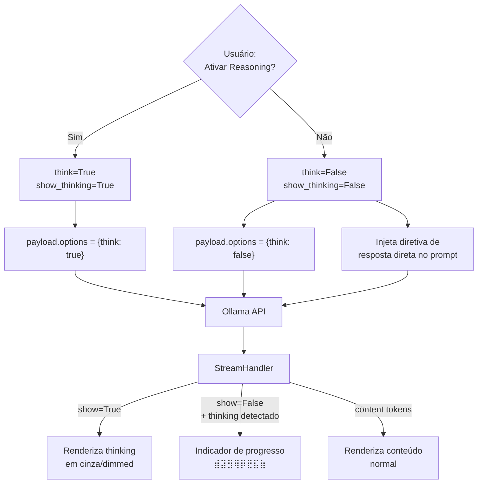

# 🟣 BLUEPRINT: FASE 2 — CONTROLE DE INFERÊNCIA E SUPRESSÃO DE REASONING

---

## 1. DIAGNÓSTICO DO PROBLEMA (LATÊNCIA FANTASMA)

### Análise da Causa Raiz

O sistema atual tem um fluxo com falha quando o usuário seleciona `n` (não ativar pensamento profundo):

```
Estado Atual (think=False, show_thinking=False):
┌─────────────────────────────────────────────────────┐
│ 1. Usuário escolhe "n" para reasoning               │
│ 2. OllamaProvider envia payload SEM "think": True    │
│ 3. Modelo Qwen3/DeepSeek-R1 IGNORA a ausência       │
│    e continua pensando intrinsecamente               │
│ 4. Ollama API emite chunks com campo "thinking"      │
│    OU tags <think> inline durante 20-40 segundos     │
│ 5. StreamHandler recebe thinking chunks              │
│ 6. show_thinking=False → _render_thinking_chunk()    │
│    executa RETURN imediato — nada é impresso          │
│ 7. Terminal: VAZIO por 20-40 segundos                │
│ 8. Usuário: "O sistema travou?"                      │
└─────────────────────────────────────────────────────┘
```

### Três Vetores de Ataque

| Vetor | Descrição | Impacto |
|---|---|---|
| **V1: API-Level** | Ollama aceita `"think": false` explícito nas options para desabilitar o thinking no nível do modelo | Elimina a geração de tokens de thinking na fonte |
| **V2: Prompt-Level** | Instrução explícita no system prompt para responder diretamente sem raciocínio interno | Reduz probabilidade de pensamento longo mesmo em modelos sem suporte a flag `think` |
| **V3: UX-Level** | Indicador de progresso visual quando tokens de thinking são detectados mas não exibidos | Elimina a percepção de "travou" como safety net |

---

## 2. ARQUITETURA DA SOLUÇÃO



### Arquivos Modificados

| Arquivo | Ação | Mudança |
|---|---|---|
| `src/models/ollama_provider.py` | **MODIFICAR** | Enviar `"think": false` explícito; injetar diretiva de resposta direta no prompt |
| `src/core/stream_handler.py` | **MODIFICAR** | Indicador de progresso silencioso quando thinking é detectado mas não exibido |
| `src/agents/critic_agent.py` | **MODIFICAR** | Aceitar flag `direct_mode` para prompt de supressão |
| `src/agents/proponent_agent.py` | **MODIFICAR** | Aceitar flag `direct_mode` para prompt de supressão |
| `src/core/controller.py` | **MODIFICAR** | Propagar `think` preference para os agentes |
| `src/cli/main.py` | **NÃO ALTERAR** | Nenhuma mudança necessária |

### Arquivos NÃO Alterados
- `src/models/model_provider.py`
- `src/models/cloud_provider.py`
- `src/config/settings.py`
- `src/conversation/conversation_manager.py`
- `src/planning/plan_generator.py`
- `src/debate/debate_engine.py`

---

## 3. CÓDIGO DE IMPLEMENTAÇÃO

### 3.1 — `src/models/ollama_provider.py` (MODIFICADO)

```python
"""
ollama_provider.py — Provider local usando Ollama HTTP API.

MUDANÇA FASE 2:
- Envia "think": false explícito quando o usuário desativa reasoning
- Injeta diretiva de supressão no prompt quando think=False em modelos de reasoning
- Timeout dinâmico baseado no modo de operação
"""

import requests
import json
import sys
from src.models.model_provider import ModelProvider, GenerationResult
from src.config.settings import OLLAMA_ENDPOINT, MODEL_NAME
from src.core.stream_handler import StreamHandler, ANSIStyle


# Diretiva injetada no topo do prompt quando reasoning está desativado
# para modelos que possuem capacidade de pensamento intrínseco.
DIRECT_RESPONSE_DIRECTIVE = (
    "IMPORTANT INSTRUCTION: Respond directly and concisely. "
    "Do NOT use <think> blocks or internal reasoning chains. "
    "Do NOT show your thought process. "
    "Go straight to your analysis. Be efficient.\n\n"
)

# Modelos que possuem reasoning intrínseco e se beneficiam
# da flag think: false + diretiva de supressão
REASONING_MODEL_KEYWORDS = ["qwen", "deepseek", "r1", "reasoning"]


class OllamaProvider(ModelProvider):
    """
    Local LLM provider using Ollama HTTP API.
    """

    def __init__(self, model_name: str = MODEL_NAME,
                 endpoint: str = OLLAMA_ENDPOINT,
                 think: bool = False,
                 show_thinking: bool = True):
        self.model_name = model_name
        self.endpoint = endpoint
        self.think = think
        self.show_thinking = show_thinking
        # Detectar se o modelo é da família reasoning
        self._is_reasoning_model = any(
            kw in model_name.lower() for kw in REASONING_MODEL_KEYWORDS
        )

    def generate(self, prompt: str, context: list = None, role: str = "user") -> str:
        """
        Gera resposta e retorna apenas o conteúdo limpo (sem pensamento).
        Mantém compatibilidade com contrato original.
        """
        result = self.generate_with_thinking(prompt, context, role)
        return result.content

    def generate_with_thinking(self, prompt: str, context: list = None,
                                role: str = "user") -> GenerationResult:
        """
        Gera resposta com streaming visual e retorna resultado estruturado.

        FASE 2: 
        - Quando think=False, envia explicitamente "think": false ao Ollama
        - Quando think=False em modelo de reasoning, injeta diretiva de supressão
        - Timeout ajustado: 120s com thinking, 90s sem (resposta esperada mais curta)
        """
        # ── Construir prompt final ──
        final_prompt = self._build_prompt(prompt)

        # ── Construir payload ──
        payload = {
            "model": self.model_name,
            "prompt": final_prompt,
            "stream": True,
        }

        # ── Configurar options com think explícito ──
        # FASE 2: Sempre enviar a flag think para modelos de reasoning
        # Isso instrui o Ollama a habilitar/desabilitar o reasoning no nível do modelo
        if self._is_reasoning_model:
            payload["options"] = {"think": self.think}
        elif self.think:
            # Para modelos não-reasoning que recebam think=True por engano
            payload["options"] = {"think": True}

        # ── Timeout dinâmico ──
        timeout = 120 if self.think else 90

        try:
            # Emitir estado: início da geração
            mode_label = "reasoning" if self.think else "direto"
            sys.stdout.write(
                f"{ANSIStyle.CYAN}⏳ Gerando com {self.model_name} "
                f"(modo {mode_label})...{ANSIStyle.RESET}\n"
            )
            sys.stdout.flush()

            response = requests.post(
                self.endpoint, json=payload, timeout=timeout, stream=True
            )
            response.raise_for_status()

            # Delegar processamento ao StreamHandler
            handler = StreamHandler(show_thinking=self.show_thinking)
            result = handler.process_ollama_stream(response.iter_lines())

            return GenerationResult(
                content=result.content,
                thinking=result.thinking,
                raw=result.raw
            )

        except requests.exceptions.RequestException as e:
            error_msg = f"Error communicating with Ollama: {str(e)}"
            return GenerationResult(content=error_msg, thinking="", raw=error_msg)

    def _build_prompt(self, original_prompt: str) -> str:
        """
        Constrói o prompt final baseado no modo de operação.

        FASE 2: Se think=False E o modelo é da família reasoning,
        injeta a diretiva DIRECT_RESPONSE_DIRECTIVE no topo do prompt
        para instruir o modelo a não usar raciocínio interno.
        """
        if not self.think and self._is_reasoning_model:
            return DIRECT_RESPONSE_DIRECTIVE + original_prompt
        return original_prompt
```

---

### 3.2 — `src/core/stream_handler.py` (MODIFICADO)

Mudanças cirúrgicas em duas áreas: a classe `StreamHandler` ganha o "Modo Silencioso de Progresso".

```python
"""
stream_handler.py — Módulo de interceptação e buffering de tokens de streaming.

Responsabilidades:
1. Parsear chunks JSON do Ollama stream
2. Separar tokens de pensamento (thinking) de tokens de conteúdo (response)
3. Detectar blocos <think>...</think> inline para modelos sem campo 'thinking' separado
4. Emitir eventos de estado para a CLI
5. Renderizar output formatado com diferenciação visual ANSI

MUDANÇA FASE 2:
6. Indicador de progresso silencioso quando thinking é detectado mas show_thinking=False

NÃO contém lógica de negócio. NÃO conhece agentes. Apenas processa stream.
"""

import sys
import re
import time
from enum import Enum
from typing import NamedTuple, Optional, Callable
from dataclasses import dataclass, field


class TokenType(Enum):
    """Classificação de cada token recebido do stream."""
    THINKING = "thinking"
    CONTENT = "content"
    STATE = "state"


class StreamResult(NamedTuple):
    """Resultado estruturado do processamento de stream completo."""
    thinking: str       # Buffer completo de pensamento (para log/debug)
    content: str        # Resposta final limpa (para histórico e relatório)
    raw: str            # Stream bruto completo (para diagnóstico)


class StateEvent:
    """Evento de telemetria emitido durante o processamento."""
    def __init__(self, event_type: str, message: str, metadata: dict = None):
        self.event_type = event_type
        self.message = message
        self.metadata = metadata or {}

    def __repr__(self):
        return f"[STATE: {self.event_type}] {self.message}"


# ─── ANSI Color Codes ───────────────────────────────────────
class ANSIStyle:
    """Códigos ANSI para formatação de terminal."""
    RESET = "\033[0m"
    DIM = "\033[2m"            # Texto dimmed/cinza para pensamento
    DIM_ITALIC = "\033[2;3m"   # Dimmed + itálico
    CYAN = "\033[36m"          # Para labels de estado
    YELLOW = "\033[33m"        # Para avisos
    GREEN = "\033[32m"         # Para confirmações
    BLUE = "\033[34m"          # Para informações de agente
    BOLD = "\033[1m"           # Para headers
    GRAY = "\033[90m"          # Cinza explícito


class SilentProgressIndicator:
    """
    FASE 2: Indicador visual de progresso para quando o modelo está
    gerando tokens de pensamento em background (show_thinking=False).

    Exibe um spinner minimalista para que o usuário saiba que
    o sistema está processando, não travado.

    Ciclo visual: ⣾ ⣽ ⣻ ⢿ ⡿ ⣟ ⣯ ⣷
    """
    SPINNER_FRAMES = ['⣾', '⣽', '⣻', '⢿', '⡿', '⣟', '⣯', '⣷']
    # Intervalo mínimo entre atualizações do spinner (em tokens, não tempo)
    # para evitar overhead de sys.stdout.write a cada token
    TOKEN_UPDATE_INTERVAL = 3

    def __init__(self):
        self._frame_index = 0
        self._token_count = 0
        self._is_active = False
        self._header_shown = False

    def tick(self):
        """
        Chamado cada vez que um token de thinking é recebido em modo silencioso.
        Atualiza o spinner a cada TOKEN_UPDATE_INTERVAL tokens.
        """
        self._token_count += 1

        if not self._header_shown:
            sys.stdout.write(
                f"{ANSIStyle.GRAY}💭 IA processando internamente "
            )
            sys.stdout.flush()
            self._header_shown = True
            self._is_active = True

        if self._token_count % self.TOKEN_UPDATE_INTERVAL == 0:
            # Mover cursor para trás sobre o último frame e escrever o novo
            frame = self.SPINNER_FRAMES[
                self._frame_index % len(self.SPINNER_FRAMES)
            ]
            sys.stdout.write(f"\b{frame}")
            sys.stdout.flush()
            self._frame_index += 1

    def finish(self):
        """Finaliza o indicador quando o conteúdo começa a chegar."""
        if self._is_active:
            sys.stdout.write(
                f"\b✓ ({self._token_count} tokens processados)"
                f"{ANSIStyle.RESET}\n"
            )
            sys.stdout.flush()
            self._is_active = False


@dataclass
class InlineThinkParser:
    """
    Parser de estado para detectar blocos <think>...</think> inline.

    Modelos sem campo 'thinking' separado emitem pensamento dentro do
    campo 'response' usando tags XML. Este parser rastreia se estamos
    dentro ou fora de um bloco <think>.

    Máquina de estados:
        OUTSIDE -> encontra '<think>' -> INSIDE
        INSIDE  -> encontra '</think>' -> OUTSIDE
    """
    inside_think: bool = False
    think_buffer: str = ""
    content_buffer: str = ""
    # Buffer parcial para detectar tags fragmentadas entre chunks
    _partial_tag_buffer: str = ""

    def process_chunk(self, chunk: str) -> tuple:
        """
        Processa um chunk de texto e separa pensamento de conteúdo.

        Returns:
            (think_text, content_text) — texto a ser exibido em cada canal
        """
        # Concatenar com buffer parcial de tag anterior
        text = self._partial_tag_buffer + chunk
        self._partial_tag_buffer = ""

        think_output = ""
        content_output = ""

        while text:
            if self.inside_think:
                # Procurar fim do bloco de pensamento
                end_idx = text.find("</think>")
                if end_idx != -1:
                    # Encontrou fechamento
                    think_part = text[:end_idx]
                    think_output += think_part
                    self.think_buffer += think_part
                    text = text[end_idx + len("</think>"):]
                    self.inside_think = False
                else:
                    # Verificar se temos uma tag parcial no final
                    partial_match = self._check_partial_close_tag(text)
                    if partial_match is not None:
                        safe_text = text[:partial_match]
                        self._partial_tag_buffer = text[partial_match:]
                        think_output += safe_text
                        self.think_buffer += safe_text
                        text = ""
                    else:
                        think_output += text
                        self.think_buffer += text
                        text = ""
            else:
                # Procurar início de bloco de pensamento
                start_idx = text.find("<think>")
                if start_idx != -1:
                    # Conteúdo antes da tag
                    content_part = text[:start_idx]
                    content_output += content_part
                    self.content_buffer += content_part
                    text = text[start_idx + len("<think>"):]
                    self.inside_think = True
                else:
                    # Verificar tag parcial de abertura no final
                    partial_match = self._check_partial_open_tag(text)
                    if partial_match is not None:
                        safe_text = text[:partial_match]
                        self._partial_tag_buffer = text[partial_match:]
                        content_output += safe_text
                        self.content_buffer += safe_text
                        text = ""
                    else:
                        content_output += text
                        self.content_buffer += text
                        text = ""

        return think_output, content_output

    def _check_partial_open_tag(self, text: str) -> Optional[int]:
        """Verifica se o final do texto pode ser início de '<think>'."""
        tag = "<think>"
        for i in range(1, len(tag)):
            if text.endswith(tag[:i]):
                return len(text) - i
        return None

    def _check_partial_close_tag(self, text: str) -> Optional[int]:
        """Verifica se o final do texto pode ser início de '</think>'."""
        tag = "</think>"
        for i in range(1, len(tag)):
            if text.endswith(tag[:i]):
                return len(text) - i
        return None


class StreamHandler:
    """
    Gerenciador principal de stream do LLM.

    Processa chunks do Ollama API e:
    1. Separa pensamento de conteúdo (via campo 'thinking' OU tags inline)
    2. Renderiza em tempo real com formatação visual diferenciada
    3. Emite eventos de estado

    FASE 2:
    4. Quando show_thinking=False e tokens de thinking são detectados,
       exibe indicador de progresso silencioso (spinner) em vez de vazio.

    Uso:
        handler = StreamHandler(show_thinking=True)
        result = handler.process_ollama_stream(response_iterator)
        # result.content contém apenas a resposta limpa
        # result.thinking contém o raciocínio capturado
    """

    def __init__(self, show_thinking: bool = True,
                 state_callback: Callable[[StateEvent], None] = None):
        """
        Args:
            show_thinking: Se True, exibe pensamento em estilo dimmed.
                          Se False, exibe indicador de progresso silencioso.
            state_callback: Função chamada quando um evento de estado é emitido.
        """
        self.show_thinking = show_thinking
        self.state_callback = state_callback
        self._inline_parser = InlineThinkParser()
        self._thinking_header_shown = False
        self._content_header_shown = False
        self._has_thinking_content = False
        # FASE 2: Indicador de progresso para modo silencioso
        self._silent_progress = SilentProgressIndicator()

    def emit_state(self, event_type: str, message: str, metadata: dict = None):
        """Emite um evento de estado para a CLI."""
        event = StateEvent(event_type, message, metadata or {})
        if self.state_callback:
            self.state_callback(event)
        else:
            # Fallback: imprimir diretamente
            sys.stdout.write(
                f"\n{ANSIStyle.CYAN}⚡ {event.message}{ANSIStyle.RESET}\n"
            )
            sys.stdout.flush()

    def process_ollama_stream(self, line_iterator) -> StreamResult:
        """
        Processa o stream completo do Ollama e retorna resultado estruturado.

        Args:
            line_iterator: Iterator de linhas bytes da resposta HTTP streaming.

        Returns:
            StreamResult com thinking, content e raw separados.
        """
        import json

        full_thinking = ""
        full_content = ""
        full_raw = ""
        has_native_thinking = False  # Flag: modelo usa campo 'thinking' nativo

        for line in line_iterator:
            if not line:
                continue
            try:
                data = json.loads(line.decode('utf-8'))
            except (json.JSONDecodeError, UnicodeDecodeError):
                continue

            # ── Estratégia 1: Campo 'thinking' nativo do Ollama ──
            thinking_chunk = data.get("thinking", "")
            response_chunk = data.get("response", "")

            if thinking_chunk:
                has_native_thinking = True
                full_thinking += thinking_chunk
                full_raw += thinking_chunk
                self._render_thinking_chunk(thinking_chunk)

            if response_chunk:
                if has_native_thinking:
                    # Modelo tem campo nativo — response é conteúdo limpo
                    if not self._content_header_shown and self._has_thinking_content:
                        self._transition_to_content()
                    full_content += response_chunk
                    full_raw += response_chunk
                    self._render_content_chunk(response_chunk)
                else:
                    # ── Estratégia 2: Parse inline de <think> tags ──
                    full_raw += response_chunk
                    think_part, content_part = self._inline_parser.process_chunk(
                        response_chunk
                    )
                    if think_part:
                        full_thinking += think_part
                        self._render_thinking_chunk(think_part)
                    if content_part:
                        if not self._content_header_shown and self._has_thinking_content:
                            self._transition_to_content()
                        full_content += content_part
                        self._render_content_chunk(content_part)

            # Verificar se o stream terminou
            if data.get("done", False):
                break

        # Finalizar renderização
        self._finalize_render()

        # Se não houve campo nativo e nem tags inline, o content é o raw
        if not has_native_thinking and not self._inline_parser.think_buffer:
            full_content = full_raw
            full_thinking = ""

        return StreamResult(
            thinking=full_thinking.strip(),
            content=full_content.strip(),
            raw=full_raw.strip()
        )

    def _render_thinking_chunk(self, chunk: str):
        """
        Renderiza um chunk de pensamento.

        FASE 2: Comportamento bifurcado:
        - show_thinking=True  → Exibe em estilo dimmed (comportamento Fase 1)
        - show_thinking=False → Aciona indicador de progresso silencioso
        """
        self._has_thinking_content = True

        if self.show_thinking:
            # Modo visível: renderizar em cinza/dimmed
            if not self._thinking_header_shown:
                sys.stdout.write(
                    f"\n{ANSIStyle.GRAY}{'─' * 40}{ANSIStyle.RESET}\n"
                    f"{ANSIStyle.DIM_ITALIC}💭 Raciocínio interno:{ANSIStyle.RESET}\n"
                    f"{ANSIStyle.DIM}"
                )
                sys.stdout.flush()
                self._thinking_header_shown = True

            sys.stdout.write(f"{ANSIStyle.DIM}{chunk}{ANSIStyle.RESET}")
            sys.stdout.flush()
        else:
            # FASE 2: Modo silencioso — exibir indicador de progresso
            self._silent_progress.tick()

    def _transition_to_content(self):
        """Renderiza a transição visual de pensamento para conteúdo."""
        # FASE 2: Finalizar o indicador silencioso se estava ativo
        self._silent_progress.finish()

        if self.show_thinking:
            sys.stdout.write(
                f"{ANSIStyle.RESET}\n"
                f"{ANSIStyle.GRAY}{'─' * 40}{ANSIStyle.RESET}\n"
                f"{ANSIStyle.GREEN}✅ Resposta:{ANSIStyle.RESET}\n"
            )
        else:
            # FASE 2: Transição limpa sem header de thinking anterior
            sys.stdout.write(
                f"{ANSIStyle.GREEN}✅ Resposta:{ANSIStyle.RESET}\n"
            )
        sys.stdout.flush()
        self._content_header_shown = True

    def _render_content_chunk(self, chunk: str):
        """Renderiza um chunk de conteúdo final (estilo normal)."""
        sys.stdout.write(chunk)
        sys.stdout.flush()

    def _finalize_render(self):
        """Limpa estado visual ao fim do stream."""
        # FASE 2: Garantir que o indicador silencioso seja finalizado
        self._silent_progress.finish()
        sys.stdout.write(f"{ANSIStyle.RESET}\n")
        sys.stdout.flush()

    def reset(self):
        """Reset do handler para reutilização."""
        self._inline_parser = InlineThinkParser()
        self._thinking_header_shown = False
        self._content_header_shown = False
        self._has_thinking_content = False
        self._silent_progress = SilentProgressIndicator()
```

---

### 3.3 — `src/agents/critic_agent.py` (MODIFICADO)

```python
"""
critic_agent.py — Agente Crítico.

MUDANÇA FASE 2:
- Aceita flag direct_mode para injetar diretiva de resposta direta
- Quando direct_mode=True, adiciona instrução para evitar prolixidade
  e raciocínio interno no system prompt
"""

from src.models.model_provider import ModelProvider
from src.conversation.conversation_manager import ConversationManager


# Diretiva adicionada ao system prompt quando em modo direto (sem reasoning)
DIRECT_MODE_SUFFIX = (
    "\n\nIMPORTANT: Respond directly without internal reasoning blocks. "
    "Do NOT use <think> tags. Go straight to your critique."
)


class CriticAgent:
    """
    Analisa ideias e encontra problemas, lacunas e vulnerabilidades estruturais.
    """

    def __init__(self, provider: ModelProvider, direct_mode: bool = False):
        self.provider = provider
        self.direct_mode = direct_mode
        self._base_system_prompt = (
            "Você é um Arquiteto de Software Sênior altamente analítico, "
            "conhecido por suas críticas rigorosas. "
            "Seu trabalho é analisar ideias de projetos/startups e encontrar "
            "lacunas estruturais, componentes "
            "ausentes, requisitos pouco claros e possíveis pontos de falha. "
            "NÃO resolva os problemas. Faça perguntas incisivas e aponte os riscos. "
            "Seja direto e técnico, evite introduções prolixas. Seja pragmático."
        )

    @property
    def system_prompt(self) -> str:
        """
        System prompt dinâmico baseado no modo de operação.
        FASE 2: Em direct_mode, adiciona diretiva de supressão de reasoning.
        """
        if self.direct_mode:
            return self._base_system_prompt + DIRECT_MODE_SUFFIX
        return self._base_system_prompt

    def analyze(self, idea: str, history: ConversationManager) -> str:
        """
        Analyze the idea and return a critique based on history.
        """
        prompt = (
            f"System: {self.system_prompt}\n\n"
            f"History Context:\n{history.get_context_string()}\n\n"
            f"Analyze this specific concept/idea:\n{idea}\n\n"
            "Provide your critique highlighting gaps and asking technical questions:"
        )

        response = self.provider.generate(
            prompt=prompt, context=history.get_history(), role="critic"
        )
        return response
```

---

### 3.4 — `src/agents/proponent_agent.py` (MODIFICADO)

```python
"""
proponent_agent.py — Agente Proponente.

MUDANÇA FASE 2:
- Aceita flag direct_mode para injetar diretiva de resposta direta
- Quando direct_mode=True, adiciona instrução para evitar prolixidade
  e raciocínio interno no system prompt
"""

from src.models.model_provider import ModelProvider


# Diretiva adicionada ao system prompt quando em modo direto (sem reasoning)
DIRECT_MODE_SUFFIX = (
    "\n\nIMPORTANT: Respond directly without internal reasoning blocks. "
    "Do NOT use <think> tags. Go straight to your technical proposal."
)


class ProponentAgent:
    """
    Defende a solução, estrutura a proposta e responde às criticas apresentadas.
    """

    def __init__(self, provider: ModelProvider, direct_mode: bool = False):
        self.provider = provider
        self.direct_mode = direct_mode
        self._base_system_prompt = (
            "Você é um Engenheiro Líder visionário, porém prático. "
            "Seu trabalho é pegar uma ideia crua ou criticada e formular "
            "uma proposta técnica "
            "forte, estruturada e viável. "
            "Defenda suas escolhas arquiteturais contra críticas, mas esteja "
            "disposto a incorporar "
            "preocupações válidas em um design melhor. Seja confiante e técnico. "
            "Seja direto e técnico, evite introduções prolixas."
        )

    @property
    def system_prompt(self) -> str:
        """
        System prompt dinâmico baseado no modo de operação.
        FASE 2: Em direct_mode, adiciona diretiva de supressão de reasoning.
        """
        if self.direct_mode:
            return self._base_system_prompt + DIRECT_MODE_SUFFIX
        return self._base_system_prompt

    def propose(self, idea: str, debate_context: str) -> str:
        """
        Formulate a defense or initial proposal given the context.
        """
        prompt = (
            f"System: {self.system_prompt}\n\n"
            f"Core Idea:\n{idea}\n\n"
            f"Current Debate Context/Critiques:\n{debate_context}\n\n"
            "Formulate your technical defense and propose a structured "
            "architectural direction:"
        )

        response = self.provider.generate(prompt=prompt, role="proponent")
        return response
```

---

### 3.5 — `src/core/controller.py` (MODIFICADO)

```python
"""
controller.py — Orquestrador do fluxo completo IdeaForge.

MUDANÇA FASE 2:
- Propaga think_preference para os agentes como direct_mode
- Quando think=False, agentes recebem direct_mode=True para injetar
  diretivas de supressão nos system prompts
"""

import sys
from src.conversation.conversation_manager import ConversationManager
from src.agents.critic_agent import CriticAgent
from src.agents.proponent_agent import ProponentAgent
from src.debate.debate_engine import DebateEngine
from src.planning.plan_generator import PlanGenerator
from src.models.model_provider import ModelProvider
from src.core.stream_handler import ANSIStyle


def emit_pipeline_state(state: str, detail: str = ""):
    """
    Emite um evento de estado visual para o terminal.
    Formato padronizado para todas as transições do pipeline.
    """
    state_icons = {
        "PIPELINE_START": "🚀",
        "CRITIC_ANALYSIS": "🔍",
        "REFINEMENT_LOOP": "🔄",
        "USER_APPROVAL": "✋",
        "DEBATE_START": "⚔️",
        "DEBATE_ROUND": "🔁",
        "PLAN_GENERATION": "📋",
        "PIPELINE_COMPLETE": "✅",
        "AGENT_THINKING": "💭",
    }
    icon = state_icons.get(state, "⚡")
    detail_str = f" — {detail}" if detail else ""
    sys.stdout.write(
        f"\n{ANSIStyle.CYAN}{ANSIStyle.BOLD}"
        f"[{icon} {state}]{detail_str}"
        f"{ANSIStyle.RESET}\n"
    )
    sys.stdout.flush()


class AgentController:
    """
    Orquestra o fluxo completo do sistema IdeaForge.
    """

    def __init__(self, provider: ModelProvider, think: bool = False):
        """
        FASE 2: Aceita parâmetro think para propagar direct_mode aos agentes.

        Args:
            provider: ModelProvider configurado
            think: Se True, reasoning está ativado. 
                   Se False, agentes recebem direct_mode=True.
        """
        self.provider = provider
        self.conversation = ConversationManager()

        # FASE 2: direct_mode é o inverso de think
        # Quando o usuário desativa o reasoning, os agentes entram em modo direto
        direct_mode = not think

        self.critic = CriticAgent(provider, direct_mode=direct_mode)
        self.proponent = ProponentAgent(provider, direct_mode=direct_mode)
        self.debate_engine = DebateEngine(self.proponent, self.critic, rounds=3)
        self.plan_generator = PlanGenerator(provider)

    def run_pipeline(self, initial_idea: str, report_filename: str = None) -> str:
        """
        Executes the main pipeline:
        1. Critic Analysis
        2. Refinement Loop
        3. Debate
        4. Plan Generation
        """
        # Step 1: Initial conversation
        emit_pipeline_state("PIPELINE_START", "Iniciando pipeline de análise")
        self.conversation.add_message("user", f"My initial idea is: {initial_idea}")

        from src.cli.main import display_response, ask_approval

        # Refinement Loop
        while True:
            emit_pipeline_state("CRITIC_ANALYSIS",
                              "Enviando ideia para análise do Agente Crítico")

            critique = self.critic.analyze(initial_idea, self.conversation)

            display_response("Critic Agent", critique)
            self.conversation.add_message("critic", critique)

            # Step 2: User Approval
            emit_pipeline_state("USER_APPROVAL", "Aguardando decisão do usuário")
            approved = ask_approval()
            if approved:
                emit_pipeline_state("USER_APPROVAL",
                                  "Ideia aprovada — avançando para debate")
                break
            else:
                emit_pipeline_state("REFINEMENT_LOOP",
                                  "Usuário solicitou refinamento")
                print("\nPor favor, responda aos pontos levantados ou explique "
                      "melhor a ideia:")
                user_refinement = input("> ")
                if not user_refinement:
                    print("[Sistema] Refinamento vazio. Encerrando o pipeline.")
                    sys.exit(0)

                self.conversation.add_message("user", user_refinement)
                # Keep looping

        # Step 3: Debate
        emit_pipeline_state("DEBATE_START",
                          f"Iniciando debate estruturado — "
                          f"{self.debate_engine.num_rounds} rounds")
        debate_result = self.debate_engine.run(initial_idea, report_filename)

        # Step 4: Plan Generation
        emit_pipeline_state("PLAN_GENERATION",
                          "Sintetizando plano de desenvolvimento técnico")
        final_plan = self.plan_generator.generate_plan(debate_result, initial_idea)

        if report_filename:
            with open(report_filename, "a", encoding="utf-8") as f:
                f.write("\n# 📋 Plano de Desenvolvimento Técnico Final\n\n")
                f.write(final_plan + "\n")

        emit_pipeline_state("PIPELINE_COMPLETE", "Pipeline concluído com sucesso")
        return final_plan
```

---

### 3.6 — `src/cli/main.py` (MODIFICADO)

Mudança mínima: propagar `think_preference` para o `AgentController`.

```python
"""
main.py — Interface CLI do IdeaForge.

MUDANÇA FASE 2:
- AgentController agora recebe think_preference para propagar direct_mode
"""

import sys
import os
import datetime

sys.path.insert(0, os.path.abspath(os.path.join(os.path.dirname(__file__), '../..')))


def prompt_idea() -> str:
    print("\n" + "=" * 50)
    print(" 💡 IdeaForge CLI - Conversor de Ideias em Planos")
    print("=" * 50)
    print("\nPor favor, descreva a sua ideia de projeto de software:")

    lines = []
    while True:
        try:
            line = input("> ")
            if not line:
                break
            lines.append(line)
        except EOFError:
            break

    return "\n".join(lines).strip()


def display_response(role: str, content: str):
    """
    Exibe resposta de um agente com formatação ANSI.
    O conteúdo aqui já está LIMPO (sem blocos de pensamento).
    """
    from src.core.stream_handler import ANSIStyle

    role_styles = {
        "critic agent": (ANSIStyle.YELLOW, "⚡"),
        "proponent agent": (ANSIStyle.GREEN, "🛡️"),
        "planner": (ANSIStyle.BLUE, "📋"),
    }
    style, icon = role_styles.get(role.lower(), (ANSIStyle.CYAN, "🤖"))

    print(f"\n{style}{ANSIStyle.BOLD}--- [{icon} {role.upper()}] ---{ANSIStyle.RESET}")
    print(content)
    print(f"{style}{'─' * 25}{ANSIStyle.RESET}")


def ask_approval() -> bool:
    while True:
        choice = input(
            "\nAprovar ideia refinada para o debate de agentes? (s/n): "
        ).strip().lower()
        if choice in ['s', 'sim', 'y', 'yes']:
            return True
        elif choice in ['n', 'nao', 'não', 'no']:
            return False
        else:
            print("Resposta inválida. Digite 's' ou 'n'.")


from src.config.settings import LLM_PROVIDER, MODEL_NAME
from src.models.ollama_provider import OllamaProvider
from src.models.cloud_provider import CloudProvider
from src.core.controller import AgentController
import requests


def select_model():
    print("\n 🔎 Buscando modelos locais no Ollama...")
    try:
        response = requests.get("http://localhost:11434/api/tags", timeout=5)
        response.raise_for_status()
        models = response.json().get("models", [])

        if not models:
            print("Nenhum modelo encontrado no Ollama. Usando o padrão.")
            return MODEL_NAME, False

        print("\nModelos Disponíveis:")
        for i, model in enumerate(models):
            print(f"[{i + 1}] {model['name']}")

        while True:
            choice = input(
                f"\nEscolha o modelo (1-{len(models)}) ou Enter para o padrão "
                f"({MODEL_NAME}): "
            )
            if not choice.strip():
                selected_model = MODEL_NAME
                break

            try:
                idx = int(choice) - 1
                if 0 <= idx < len(models):
                    selected_model = models[idx]['name']
                    break
                print("Opção inválida.")
            except ValueError:
                print("Por favor, digite um número válido.")

        # Ask for Deep Thinking if the model supports it
        reasoning_keywords = ["qwen", "deepseek", "reasoning", "r1"]
        think_preference = False
        if any(keyword in selected_model.lower() for keyword in reasoning_keywords):
            while True:
                think_choice = input(
                    f"\nEste modelo ({selected_model}) suporta pensamento profundo "
                    f"(Reasoning). Deseja ativar? (s/n): "
                ).strip().lower()
                if think_choice in ['s', 'sim', 'y', 'yes']:
                    think_preference = True
                    print("🧠 Pensamento profundo ativado.")
                    break
                elif think_choice in ['n', 'nao', 'não', 'no']:
                    print("⚡ Modo direto ativado — respostas mais rápidas.")
                    break
                else:
                    print("Resposta inválida. Digite 's' ou 'n'.")

        return selected_model, think_preference

    except Exception as e:
        print(f"⚠️ Não foi possível carregar os modelos do Ollama: {str(e)}")
        print(f"Iremos usar a variável de ambiente: {MODEL_NAME}")
        return MODEL_NAME, False


def get_provider(selected_model: str, think_preference: bool):
    if LLM_PROVIDER.lower() == "ollama":
        return OllamaProvider(
            model_name=selected_model,
            think=think_preference,
            show_thinking=think_preference  # Mostrar pensamento apenas se ativado
        )
    else:
        return CloudProvider(model_name=selected_model)


def main():
    selected_model, think_preference = select_model()

    idea = prompt_idea()
    if not idea:
        print("Nenhuma ideia inserida. Encerrando.")
        sys.exit(0)

    provider = get_provider(selected_model, think_preference)
    # FASE 2: Propagar think_preference para o AgentController
    controller = AgentController(provider, think=think_preference)

    timestamp = datetime.datetime.now().strftime("%Y%m%d_%H%M%S")
    report_filename = f"debate_RELATORIO_{timestamp}.md"

    with open(report_filename, "w", encoding="utf-8") as f:
        f.write(
            f"# 📋 Relatório de Debate IdeaForge - "
            f"{datetime.datetime.now().strftime('%d/%m/%Y %H:%M:%S')}\n\n"
        )
        f.write(f"**Ideia Inicial:**\n{idea}\n\n---\n")

    try:
        final_plan = controller.run_pipeline(idea, report_filename)

        print("\n" + "=" * 50)
        print("  🏆 PLANO DE DESENVOLVIMENTO FINALIZADO  ")
        print("=" * 50 + "\n")
        print(final_plan)
        print("\n" + "=" * 50)

    except Exception as e:
        print(f"\n❌ Erro durante a execução do pipeline: {str(e)}")
        sys.exit(1)


if __name__ == "__main__":
    main()
```

---

## 4. EXEMPLO DE OUTPUT VISUAL ESPERADO

### Cenário: Reasoning DESATIVADO (usuário escolheu "n")

```
🔎 Buscando modelos locais no Ollama...

Modelos Disponíveis:
[1] qwen3:8b
[2] llama3:8b

Escolha o modelo (1-2): 1

Este modelo (qwen3:8b) suporta pensamento profundo (Reasoning). Deseja ativar? (s/n): n
⚡ Modo direto ativado — respostas mais rápidas.

[🚀 PIPELINE_START] — Iniciando pipeline de análise

[🔍 CRITIC_ANALYSIS] — Enviando ideia para análise do Agente Crítico
⏳ Gerando com qwen3:8b (modo direto)...
💭 IA processando internamente ⣻✓ (47 tokens processados)
✅ Resposta:

## Análise Crítica

1. **Protocolo de sincronização não definido** — Você menciona...
2. **Resolução de conflitos ausente** — O que acontece quando...
```

### Cenário: Reasoning ATIVADO (usuário escolheu "s")

```
Este modelo (qwen3:8b) suporta pensamento profundo (Reasoning). Deseja ativar? (s/n): s
🧠 Pensamento profundo ativado.

[🔍 CRITIC_ANALYSIS] — Enviando ideia para análise do Agente Crítico
⏳ Gerando com qwen3:8b (modo reasoning)...

────────────────────────────────────────
💭 Raciocínio interno:
The user wants to build a task management system. Let me analyze
the architectural gaps... The idea mentions "real-time sync" but
doesn't specify the protocol...
────────────────────────────────────────
✅ Resposta:

## Análise Crítica
...
```

---

## 5. TESTES

### `tests/test_stream_handler.py` (ADIÇÕES)

```python
# ── FASE 2: Testes adicionais ──────────────────────────────

class TestSilentProgressIndicator:
    """Testes para o indicador de progresso silencioso (Fase 2)."""

    def test_tick_increments_counter(self):
        from src.core.stream_handler import SilentProgressIndicator
        indicator = SilentProgressIndicator()
        indicator.tick()
        assert indicator._token_count == 1
        indicator.tick()
        assert indicator._token_count == 2

    def test_finish_resets_active(self):
        from src.core.stream_handler import SilentProgressIndicator
        indicator = SilentProgressIndicator()
        indicator.tick()  # Ativar
        assert indicator._is_active is True
        indicator.finish()
        assert indicator._is_active is False

    def test_finish_without_activation_is_noop(self):
        from src.core.stream_handler import SilentProgressIndicator
        indicator = SilentProgressIndicator()
        # Não deve lançar exceção
        indicator.finish()
        assert indicator._is_active is False


class TestStreamHandlerSilentMode:
    """Testes para o StreamHandler em modo show_thinking=False (Fase 2)."""

    def _make_line_iterator(self, chunks):
        for chunk in chunks:
            yield json.dumps(chunk).encode('utf-8')

    def test_silent_mode_still_captures_thinking(self):
        """Mesmo em modo silencioso, o thinking deve ser capturado no resultado."""
        chunks = [
            {"thinking": "Silent reasoning...", "response": "", "done": False},
            {"thinking": "", "response": "Final answer.", "done": True},
        ]
        handler = StreamHandler(show_thinking=False)
        result = handler.process_ollama_stream(self._make_line_iterator(chunks))

        # Thinking foi capturado mesmo sem ser exibido em dimmed
        assert result.thinking == "Silent reasoning..."
        assert result.content == "Final answer."

    def test_silent_mode_inline_tags(self):
        """Tags <think> inline em modo silencioso."""
        chunks = [
            {"response": "<think>internal</think>visible", "done": True},
        ]
        handler = StreamHandler(show_thinking=False)
        result = handler.process_ollama_stream(self._make_line_iterator(chunks))

        assert result.thinking == "internal"
        assert result.content == "visible"


class TestOllamaProviderPromptInjection:
    """Testes para a injeção de diretiva de resposta direta (Fase 2)."""

    def test_direct_mode_injects_directive(self):
        from src.models.ollama_provider import (
            OllamaProvider, DIRECT_RESPONSE_DIRECTIVE
        )
        provider = OllamaProvider(
            model_name="qwen3:8b", think=False, show_thinking=False
        )
        result = provider._build_prompt("Test prompt")
        assert result.startswith("IMPORTANT INSTRUCTION:")
        assert "Test prompt" in result

    def test_reasoning_mode_no_injection(self):
        from src.models.ollama_provider import OllamaProvider
        provider = OllamaProvider(
            model_name="qwen3:8b", think=True, show_thinking=True
        )
        result = provider._build_prompt("Test prompt")
        assert result == "Test prompt"

    def test_non_reasoning_model_no_injection(self):
        from src.models.ollama_provider import OllamaProvider
        provider = OllamaProvider(
            model_name="llama3:8b", think=False, show_thinking=False
        )
        result = provider._build_prompt("Test prompt")
        # llama3 não é modelo de reasoning, não injeta diretiva
        assert result == "Test prompt"


class TestAgentDirectMode:
    """Testes para o direct_mode nos agentes (Fase 2)."""

    def test_critic_direct_mode_prompt(self):
        from src.agents.critic_agent import CriticAgent, DIRECT_MODE_SUFFIX
        provider = MockProvider()
        critic = CriticAgent(provider, direct_mode=True)
        assert "Do NOT use <think> tags" in critic.system_prompt

    def test_critic_normal_mode_prompt(self):
        from src.agents.critic_agent import CriticAgent
        provider = MockProvider()
        critic = CriticAgent(provider, direct_mode=False)
        assert "Do NOT use <think> tags" not in critic.system_prompt

    def test_proponent_direct_mode_prompt(self):
        from src.agents.proponent_agent import ProponentAgent, DIRECT_MODE_SUFFIX
        provider = MockProvider()
        proponent = ProponentAgent(provider, direct_mode=True)
        assert "Do NOT use <think> tags" in proponent.system_prompt

    def test_proponent_normal_mode_prompt(self):
        from src.agents.proponent_agent import ProponentAgent
        provider = MockProvider()
        proponent = ProponentAgent(provider, direct_mode=False)
        assert "Do NOT use <think> tags" not in proponent.system_prompt
```

---

## 6. MATRIZ DE RASTREABILIDADE (FASE 2)

| Requisito | Componente | Arquivo | Método/Propriedade | Teste |
|---|---|---|---|---|
| Enviar `think: false` explícito ao Ollama | OllamaProvider | `ollama_provider.py` | `generate_with_thinking()` | `test_direct_mode_injects_directive` |
| Injetar diretiva de supressão no prompt | OllamaProvider | `ollama_provider.py` | `_build_prompt()` | `test_direct_mode_injects_directive`, `test_non_reasoning_model_no_injection` |
| Não injetar em modelos não-reasoning | OllamaProvider | `ollama_provider.py` | `_build_prompt()` | `test_non_reasoning_model_no_injection` |
| Não injetar quando think=True | OllamaProvider | `ollama_provider.py` | `_build_prompt()` | `test_reasoning_mode_no_injection` |
| System prompt com diretiva em direct_mode | CriticAgent | `critic_agent.py` | `system_prompt` (property) | `test_critic_direct_mode_prompt` |
| System prompt sem diretiva em modo normal | CriticAgent | `critic_agent.py` | `system_prompt` (property) | `test_critic_normal_mode_prompt` |
| System prompt com diretiva em direct_mode | ProponentAgent | `proponent_agent.py` | `system_prompt` (property) | `test_proponent_direct_mode_prompt` |
| Indicador de progresso silencioso | SilentProgressIndicator | `stream_handler.py` | `tick()`, `finish()` | `test_tick_increments_counter`, `test_finish_resets_active` |
| Captura thinking mesmo em modo silencioso | StreamHandler | `stream_handler.py` | `process_ollama_stream()` | `test_silent_mode_still_captures_thinking` |
| Propagar think para AgentController | AgentController | `controller.py` | `__init__()` | Via testes de pipeline existentes |

---

## 7. ORDEM DE IMPLEMENTAÇÃO

```
1. src/core/stream_handler.py        ← MODIFICAR (adicionar SilentProgressIndicator + bifurcação no _render_thinking_chunk)
2. src/models/ollama_provider.py     ← MODIFICAR (think:false explícito + _build_prompt + DIRECT_RESPONSE_DIRECTIVE)
3. src/agents/critic_agent.py        ← MODIFICAR (aceitar direct_mode + system_prompt dinâmico)
4. src/agents/proponent_agent.py     ← MODIFICAR (aceitar direct_mode + system_prompt dinâmico)
5. src/core/controller.py            ← MODIFICAR (aceitar think param + propagar direct_mode)
6. src/cli/main.py                   ← MODIFICAR (propagar think_preference para AgentController)
7. tests/test_stream_handler.py      ← ADICIONAR (novos testes de SilentProgress + DirectMode)
```

---

## 8. INVARIANTES GARANTIDAS

1. **Contrato `generate(prompt, context, role) -> str` preservado** — Nenhuma mudança na assinatura pública.
2. **Contrato `analyze(idea, history) -> str` preservado** — Apenas `__init__` recebe novo parâmetro opcional `direct_mode=False`.
3. **Contrato `propose(idea, context) -> str` preservado** — Apenas `__init__` recebe novo parâmetro opcional `direct_mode=False`.
4. **Backward compatibility total** — `direct_mode` tem default `False`, `think` tem default `False` no controller. Código existente funciona sem alterações.
5. **Três camadas de defesa contra latência fantasma:**
   - **Camada 1 (API):** `"think": false` no payload do Ollama
   - **Camada 2 (Prompt):** Diretiva `DIRECT_RESPONSE_DIRECTIVE` + sufixo nos system prompts dos agentes
   - **Camada 3 (UX):** `SilentProgressIndicator` como safety net visual
6. **Sem novas dependências externas** — Zero adições ao `requirements.txt`.