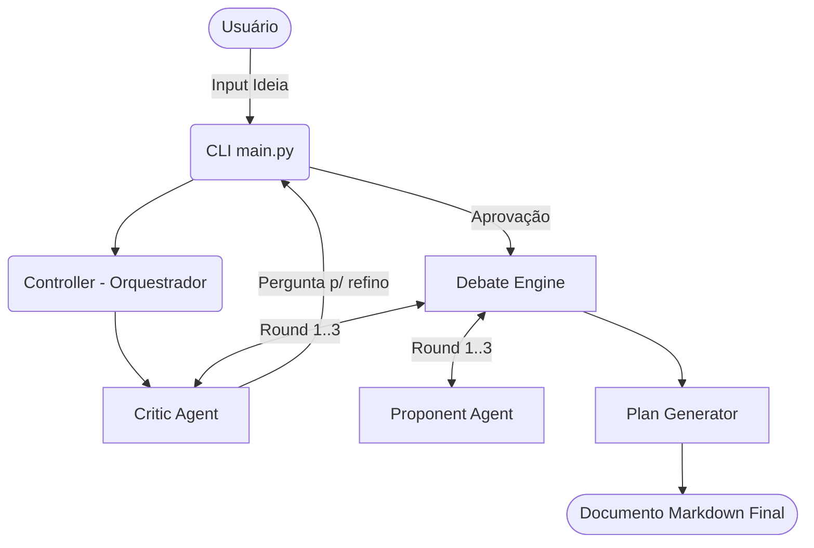

# IdeaForge CLI - Conclusão do MVP

A construção do IdeaForge CLI — o sistema de debate de ideias assistido por IA — foi concluída seguindo as diretrizes rigorosas do Technical Blueprint (Plano de 10 Fases). 

## O que foi construído

A arquitetura do sistema foi desenvolvida com base numa orquestração separada em camadas:
1. **Model Provider Layer**: Onde abstraímos a comunicação com o LLM (Ollama API via HTTP Localhost e mock para Cloud Layer).
2. **Agents Layer**: Onde implementamos o [CriticAgent](file:///c:/Users/Usuario/Desktop/novo1/idea-forge/src/agents/critic_agent.py#4-32) que analisa buracos na ideia do usuário e o [ProponentAgent](file:///c:/Users/Usuario/Desktop/novo1/idea-forge/src/agents/proponent_agent.py#3-31) que desenha arquiteturas defensivas baseadas nesse escrutínio.
3. **Debate Engine & Plan Generator Layer**: Onde configuramos loops conversacionais estruturados para extrair decisões lógicas robustas que alimentam o relatório de saída (Markdown).
4. **CLI & Controller**: Onde orquestramos a interface de terminal e conectamos o fluxo determinístico.

### Pipeline Testado e Finalizado
Todo o sistema já pode ser acessado e interagido pelo CLI. Um ciclo básico segue a seguinte arquitetura de execução:


## Como Verificar

### Validação Automática Completa
Implementamos os testes no pytest local. Com o pacote `pytest` instalado as execuções foram submetidas ao comando `python -m pytest tests/` obtendo sucesso (100% Passed) indicando ausência de problemas de resolução de pacotes e ciclos lógicos.

### Execução Manual do Sistema
Para executar o software:
1. Abra um terminal na pasta do projeto: `c:/Users/Usuario/Desktop/novo1/idea-forge/`
2. Garanta que as variáveis virtuais base estão configuradas em seu `.env` (se for usar o Ollama Local, inicie seu servidor Ollama separadamente e valide se o modelo "llama3" baixado atende - editável em `OLLAMA_ENDPOINT`/`MODEL_NAME` nas configurações ou via variáveis ambiente).
3. Rode o CLI:
```bash
python src/cli/main.py
```
O sistema pedirá por uma ideia detalhada em texto corrido e inciará a simulação de papéis da IA. Sinta-se a vontade para testar!
