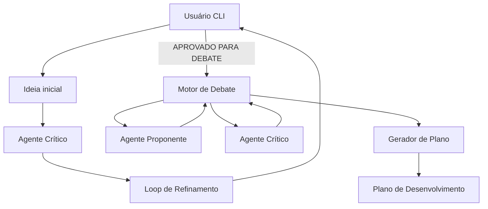
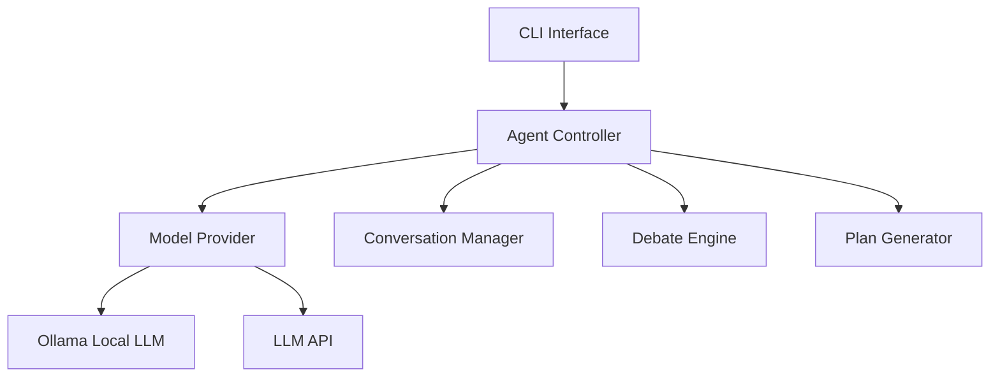
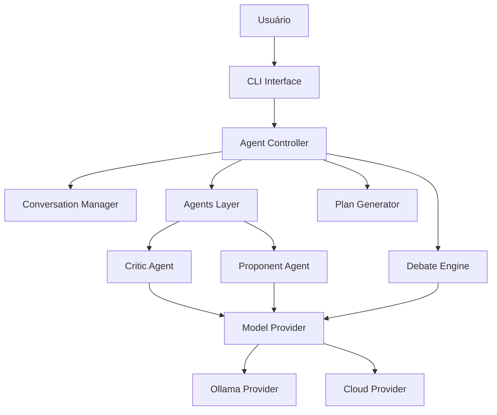
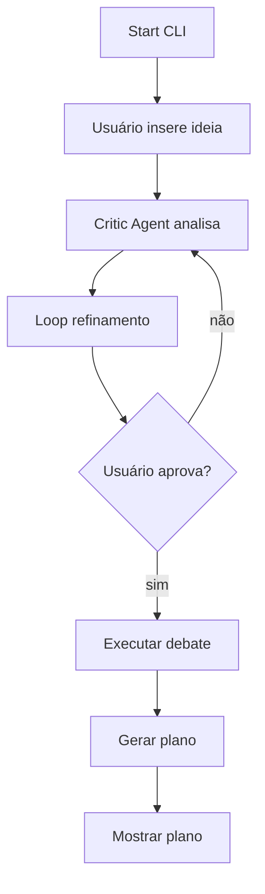

# PRD — MVP Sistema de Debate de Ideias Assistido por IA

Versão: 0.1 — MVP

---

# 1. Visão Geral do Produto

Nome do projeto
IdeaForge CLI

Missão
Permitir que desenvolvedores transformem ideias vagas em **planos de desenvolvimento estruturados** através de **refinamento iterativo e debate entre agentes de IA** antes da implementação de código.

Problema que resolve
Projetos de software frequentemente começam com ideias incompletas ou ambíguas. Isso gera:

* arquitetura frágil
* retrabalho
* alucinação de LLMs
* desperdício de tempo de desenvolvimento

O sistema cria um **processo estruturado de análise antes da codificação**.

Público-alvo (personas)

Persona 1
Lucas — Engenheiro Backend

Dor
Começa projetos com ideias vagas e precisa estruturar arquitetura antes de codificar.

Persona 2
Carla — Indie Hacker

Dor
Precisa validar ideias de produto rapidamente sem gastar semanas planejando.

Persona 3
André — Tech Lead

Dor
Precisa transformar ideias de time em documentação estruturada para execução.

Proposta de valor

Transformar:

Ideia vaga
→ questionamento crítico
→ debate estruturado
→ plano técnico executável

Diferenciais

Comparado com uso direto de LLM:

| Abordagem         | Problema                |
| ----------------- | ----------------------- |
| Prompt único      | respostas superficiais  |
| Chat linear       | pouca estrutura         |
| LLM coding direto | alucinação arquitetural |

O sistema cria um **pipeline cognitivo estruturado**.

---

# 2. Arquitetura de Alto Nível

Fluxo principal



Arquitetura do sistema



Tecnologias

Linguagem
Python

Motivo
simplicidade + integração forte com LLM

Interface
CLI

Motivo
evitar complexidade de frontend

LLM Provider

Suporte a:

Ollama (local)
APIs cloud

Motivo

* flexibilidade
* privacidade
* custo

Modelo de deploy

Local CLI application

Nenhuma infraestrutura necessária.

Padrões de design

Command Pattern
usado no CLI

Strategy Pattern
para seleção de LLM provider

Controller Pattern
coordenação dos agentes

---

# 3. Estrutura de Diretórios

Estrutura do projeto

```
idea-forge/

src/
│
├── cli/
│   └── main.py
│
├── agents/
│   ├── critic_agent.py
│   ├── proponent_agent.py
│
├── debate/
│   └── debate_engine.py
│
├── planning/
│   └── plan_generator.py
│
├── models/
│   └── model_provider.py
│
├── conversation/
│   └── conversation_manager.py
│
├── core/
│   └── controller.py
│
├── config/
│   └── settings.py
│
tests/

README.md
requirements.txt
.env.example
```

Explicação das pastas

cli/
Entrada do sistema.

agents/
Implementação dos agentes de IA.

debate/
Motor de debate multi-agente.

planning/
Geração de plano final.

models/
Integração com LLM providers.

conversation/
Gestão do histórico.

core/
Coordenação do sistema.

---

# 4. Requisitos Funcionais

RF-001
Entrada de ideia

Usuário digita uma ideia no terminal.

Sistema registra a ideia.

Resultado
ideia enviada ao agente crítico.

---

RF-002
Refinamento iterativo

O agente crítico:

* identifica lacunas
* faz perguntas
* propõe melhorias

Loop continua até:

APROVADO PARA DEBATE

---

RF-003
Execução de debate

Sistema instancia dois agentes:

Proponente
Crítico

Eles debatem a proposta.

Rodadas de debate:

3 a 5 ciclos.

---

RF-004
Geração de documento de análise

Saída do debate:

* pontos fortes
* pontos fracos
* riscos
* sugestões

---

RF-005
Aprovação humana

Usuário decide:

APROVAR
ou
REFINAR NOVAMENTE

---

RF-006
Geração do plano de desenvolvimento

Plano inclui:

* arquitetura
* módulos
* fases
* responsabilidades

---

# 5. Requisitos Não Funcionais

Performance

Tempo máximo por etapa

| etapa       | tempo |
| ----------- | ----- |
| refinamento | <20s  |
| debate      | <40s  |
| plano       | <15s  |

---

Segurança

Sem autenticação.

Uso local.

---

Escalabilidade

Não aplicável no MVP.

---

Compatibilidade

Python 3.10+

OS

Linux
Mac
Windows

---

# 6. Justificativa de Stack

Python

Motivo

* integração com LLM
* prototipagem rápida

Alternativas

Node
Go

Motivo da escolha

simplicidade.

---

Ollama

Motivo

execução local de LLM.

Benefícios

* privacidade
* custo zero
* latência baixa

---

LLM APIs

Motivo

modelos maiores disponíveis.

---

# 7. Componentes Críticos

CLI Interface

Responsável por:

* receber ideia
* mostrar respostas
* controlar fluxo

---

Agent Controller

Coordena:

* refinamento
* debate
* geração de plano

---

Model Provider

Interface comum:

```
generate(prompt)
```

Implementações:

OllamaProvider
CloudProvider

---

Conversation Manager

Mantém:

* histórico
* contexto

Evita perda de informação.

---

Debate Engine

Executa rounds.

Fluxo

```
proponente responde
critico responde
loop
```

---

Plan Generator

Transforma debate em:

plano estruturado.

---

# 8. Pipeline Cognitivo

Pipeline

```
IDEIA
 ↓
CRÍTICA
 ↓
REFINAMENTO
 ↓
DEBATE
 ↓
PLANO
```

Cada etapa reduz ambiguidade.

---

# 9. Integrações Externas

Ollama

Configuração

```
ollama serve
```

---

Cloud LLM

Env

```
LLM_API_KEY=
LLM_PROVIDER=
```

---

# 10. Segurança

Sistema local.

Sem autenticação.

Sem armazenamento sensível.

---

# 11. Infraestrutura

Não possui.

Rodando localmente.

---

# 12. Extensibilidade

Novos agentes podem ser adicionados.

Exemplo

```
agents/
architect_agent.py
security_agent.py
```

---

# 13. Limitações

LLM pode alucinar.

Debate depende de qualidade do modelo.

Sem persistência.

---

# 14. Roadmap

Versão 0.2

* persistência
* export markdown
* mais agentes

Versão 0.3

* interface web

Versão 1.0

* multi-projeto
* memória longa

---

# 15. Guia de Replicação

Pré-requisitos

Python 3.10+

Instalar

```
pip install -r requirements.txt
```

Executar

```
python src/cli/main.py
```

Configurar env

```
LLM_PROVIDER=ollama
MODEL_NAME=llama3
```

Rodar

```
python main.py
```

Sistema inicia no terminal.

Usuário insere ideia.

Pipeline executa.

Plano final é gerado.


-------------

# Blueprint Técnico — IdeaForge CLI

Arquitetura Técnica Definitiva do MVP

Versão: 0.1

---

# 1. Propósito do Blueprint

Este documento define **a estrutura técnica exata do sistema** antes da implementação.

Funções do blueprint:

* eliminar ambiguidade arquitetural
* definir responsabilidades dos módulos
* padronizar interfaces
* garantir construção determinística do sistema

Este documento responde **como o sistema é estruturado internamente**.

---

# 2. Arquitetura Geral do Sistema

O sistema segue arquitetura **orquestrada em camadas**.



---

# 3. Camadas do Sistema

## 3.1 Interface Layer

Responsabilidade:

Interação com usuário via terminal.

Componentes:

```
src/cli/
main.py
```

Funções:

* receber input do usuário
* exibir respostas
* controlar comandos

Regra estrutural:

CLI **não contém lógica de negócio**.

---

## 3.2 Controller Layer

Responsabilidade:

Orquestrar o fluxo completo do sistema.

Componente:

```
src/core/controller.py
```

Funções:

* iniciar pipeline
* controlar etapas
* coordenar agentes
* controlar aprovação do usuário

Fluxo interno:

```
receber ideia
↓
enviar para critic_agent
↓
executar loop de refinamento
↓
aprovação do usuário
↓
executar debate
↓
gerar plano
```

---

## 3.3 Conversation Layer

Responsabilidade:

Gerenciar contexto das interações.

Componente:

```
src/conversation/conversation_manager.py
```

Funções:

* armazenar histórico
* recuperar contexto
* preparar prompt acumulado

Estrutura de dados:

```
conversation_history = [
    {role: "user", content: "..."},
    {role: "assistant", content: "..."}
]
```

---

## 3.4 Agents Layer

Responsabilidade:

Executar raciocínio especializado.

Diretório:

```
src/agents/
```

Agentes iniciais:

```
critic_agent.py
proponent_agent.py
```

---

### Critic Agent

Função:

Analisar ideias e encontrar problemas.

Responsabilidades:

* identificar lacunas
* questionar premissas
* sugerir melhorias

Interface:

```
analyze(idea, history) -> critique
```

---

### Proponent Agent

Função:

Defender e estruturar proposta.

Responsabilidades:

* organizar solução
* propor arquitetura
* responder críticas

Interface:

```
propose(idea, debate_context) -> defense
```

---

# 4. Debate Engine

Responsabilidade:

Executar debate estruturado entre agentes.

Localização:

```
src/debate/debate_engine.py
```

Estrutura do debate:

```
round 1
proponent responde

round 2
critic responde

round 3
proponent responde
```

Número padrão de rounds

3

Saída:

```
debate_result = {
    strengths,
    weaknesses,
    risks,
    recommendations
}
```

---

# 5. Plan Generator

Responsabilidade:

Transformar debate em plano técnico.

Localização:

```
src/planning/plan_generator.py
```

Entrada:

```
debate_result
idea
```

Saída:

```
development_plan
```

Conteúdo gerado:

* arquitetura sugerida
* módulos
* fases de implementação
* responsabilidades técnicas

---

# 6. Model Provider Layer

Responsabilidade:

Abstrair acesso a LLMs.

Localização:

```
src/models/model_provider.py
```

Interface base:

```
class ModelProvider:

    def generate(prompt, context, role):
        pass
```

Implementações:

```
OllamaProvider
CloudProvider
```

---

# 7. Ollama Provider

Localização:

```
src/models/ollama_provider.py
```

Função:

Enviar prompts para modelos locais.

Endpoint padrão:

```
http://localhost:11434/api/generate
```

Configuração:

```
MODEL_NAME=llama3
```

---

# 8. Cloud Provider

Localização:

```
src/models/cloud_provider.py
```

Função:

Conectar com APIs externas.

Exemplo:

OpenAI
Anthropic
Google

Interface igual ao provider local.

---

# 9. Fluxo de Execução do Sistema

Fluxo completo:



---

# 10. Contratos Entre Módulos

CriticAgent

Entrada

```
idea: string
history: conversation[]
```

Saída

```
critique: string
```

---

ProponentAgent

Entrada

```
refined_idea
debate_context
```

Saída

```
defense: string
```

---

DebateEngine

Entrada

```
idea
critic_agent
proponent_agent
```

Saída

```
debate_result
```

---

PlanGenerator

Entrada

```
debate_result
```

Saída

```
development_plan
```

---

# 11. Estrutura de Pastas Final

```
idea-forge/

src/

cli/
main.py

core/
controller.py

agents/
critic_agent.py
proponent_agent.py

debate/
debate_engine.py

planning/
plan_generator.py

models/
model_provider.py
ollama_provider.py
cloud_provider.py

conversation/
conversation_manager.py

config/
settings.py
```

---

# 12. Regras Arquiteturais

Regra 1
CLI nunca contém lógica de negócio.

Regra 2
Controller controla o fluxo.

Regra 3
Agentes não acessam CLI.

Regra 4
Agentes não acessam filesystem.

Regra 5
Apenas ModelProvider comunica com LLM.

Regra 6
DebateEngine não gera prompts diretamente.

Ele usa agentes.

---

# 13. Extensibilidade Arquitetural

Novos agentes podem ser adicionados.

Exemplo:

```
agents/

architect_agent.py
security_agent.py
performance_agent.py
```

Debate Engine pode aceitar múltiplos agentes.

---

# 14. Limites do MVP

Sem persistência.

Sem banco de dados.

Sem UI.

Sem paralelismo.

Sistema sequencial.

---

Fim do Blueprint Técnico.


---------------

# Plano de Fases — Construção Determinística do MVP IdeaForge CLI

Sequência obrigatória de construção do sistema.

A ordem é **imutável**.

Cada fase é **executável e validável independentemente**.

Total de fases:

1. Estrutura Base do Projeto
2. Model Provider (LLM Abstraction)
3. CLI Interface
4. Conversation Manager
5. Agents Layer
6. Debate Engine
7. Plan Generator
8. Controller Orchestrator
9. Pipeline End-to-End
10. Hardening e Testes Finais

---

# FASE 1 — Estrutura Base do Projeto

Arquivos gerados:

```
idea-forge/

src/
cli/
core/
agents/
debate/
planning/
models/
conversation/
config/

tests/

requirements.txt
.env.example
README.md
```

Objetivo

Criar a estrutura estrutural obrigatória do sistema.

Escopo inclui

* criação das pastas
* criação de arquivos vazios
* configuração Python
* dependências mínimas

Escopo não inclui

* lógica de negócio
* chamadas LLM
* agentes

Dependências

nenhuma

Critério de conclusão

Projeto executa:

```
python src/cli/main.py
```

retornando:

```
IdeaForge CLI initialized
```

---

# FASE 2 — Model Provider Layer

Arquivos criados

```
src/models/model_provider.py
src/models/ollama_provider.py
src/models/cloud_provider.py
```

Objetivo

Criar interface única para comunicação com LLM.

Contrato obrigatório

```
generate(prompt, context, role) -> string
```

Implementações

OllamaProvider

endpoint

```
http://localhost:11434/api/generate
```

CloudProvider

suporta APIs externas.

Fluxo interno

1 criar prompt
2 enviar para provider
3 receber resposta
4 retornar texto

Escopo inclui

* abstração provider
* integração ollama

Escopo não inclui

* lógica de agentes
* debate

Critério de conclusão

Teste:

```
provider.generate("Say hello")
```

retorna resposta válida.

---

# FASE 3 — CLI Interface

Arquivos

```
src/cli/main.py
```

Objetivo

Criar interface terminal.

Funções obrigatórias

1 receber ideia inicial
2 exibir respostas da IA
3 solicitar aprovação

Fluxo CLI

```
start
↓
input ideia
↓
mostrar resposta IA
↓
perguntar aprovação
```

Escopo inclui

* input terminal
* output terminal

Escopo não inclui

* agentes
* debate
* plano

Critério de conclusão

CLI aceita input do usuário.

---

# FASE 4 — Conversation Manager

Arquivos

```
src/conversation/conversation_manager.py
```

Objetivo

Gerenciar histórico de conversas.

Modelo de dados

```
message = {
role,
content
}
```

Estrutura

```
history = []
```

Funções

```
add_message()
get_history()
reset()
```

Escopo inclui

* persistência em memória

Escopo não inclui

* banco de dados

Critério de conclusão

Histórico recuperável entre chamadas.

---

# FASE 5 — Agents Layer

Arquivos

```
src/agents/critic_agent.py
src/agents/proponent_agent.py
```

Objetivo

Implementar agentes especializados.

CriticAgent

Responsabilidade

* analisar ideia
* detectar lacunas

Interface

```
analyze(idea, history) -> critique
```

ProponentAgent

Responsabilidade

* defender solução
* estruturar proposta

Interface

```
propose(idea, context) -> argument
```

Escopo inclui

* prompts especializados
* chamadas ao provider

Escopo não inclui

* debate engine

Critério de conclusão

Agentes respondem a prompts.

---

# FASE 6 — Debate Engine

Arquivos

```
src/debate/debate_engine.py
```

Objetivo

Executar debate estruturado.

Estrutura de rounds

```
round 1 proponent
round 2 critic
round 3 proponent
```

Fluxo

1 iniciar debate
2 executar rodada proponente
3 executar rodada crítico
4 repetir até limite
5 gerar resultado

Resultado final

```
{
strengths,
weaknesses,
risks,
recommendations
}
```

Critério de conclusão

Debate retorna estrutura final.

---

# FASE 7 — Plan Generator

Arquivos

```
src/planning/plan_generator.py
```

Objetivo

Transformar debate em plano técnico.

Entrada

```
debate_result
```

Saída

```
development_plan
```

Conteúdo

* arquitetura sugerida
* módulos
* fases de implementação

Critério de conclusão

Plano textual gerado.

---

# FASE 8 — Controller Orchestrator

Arquivos

```
src/core/controller.py
```

Objetivo

Orquestrar pipeline completo.

Fluxo obrigatório

1 receber ideia
2 executar critic agent
3 iniciar loop refinamento
4 aguardar aprovação
5 executar debate
6 gerar plano
7 retornar resultado

Critério de conclusão

Pipeline executa sequencialmente.

---

# FASE 9 — Pipeline End-to-End

Objetivo

Integrar todos os módulos.

Fluxo completo

```
User Input
↓
Critic Agent
↓
Refinement Loop
↓
User Approval
↓
Debate Engine
↓
Plan Generator
↓
Output
```

Critério de conclusão

Sistema gera plano completo a partir de ideia.

---

# FASE 10 — Hardening e Testes

Arquivos criados

```
tests/
test_agents.py
test_debate.py
test_pipeline.py
```

Objetivo

Garantir estabilidade.

Testes obrigatórios

Agents respondem

Debate executa rounds

Pipeline completo executa

Critério de conclusão

Todos os testes passam.

---

# Dependências entre Fases

```
Fase 1 → base

Fase 2 → depende fase 1

Fase 3 → depende fase 1

Fase 4 → depende fase 1

Fase 5 → depende fase 2 + fase 4

Fase 6 → depende fase 5

Fase 7 → depende fase 6

Fase 8 → depende fases 5 6 7

Fase 9 → depende todas anteriores

Fase 10 → depende fase 9
```

---

# Regra Anti-Alucinação de Implementação

A IA construtora deve:

proibir

* criação de novos módulos fora da estrutura
* alteração de contratos definidos
* mudança de fluxo pipeline

permitir apenas

* implementação dos arquivos listados

---

# Resultado Esperado

Após conclusão da fase 10 o sistema deve executar:

```
python main.py
```

Fluxo:

```
usuário insere ideia
↓
IA refina
↓
agentes debatem
↓
plano técnico gerado
```
